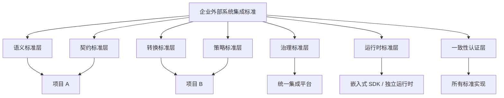
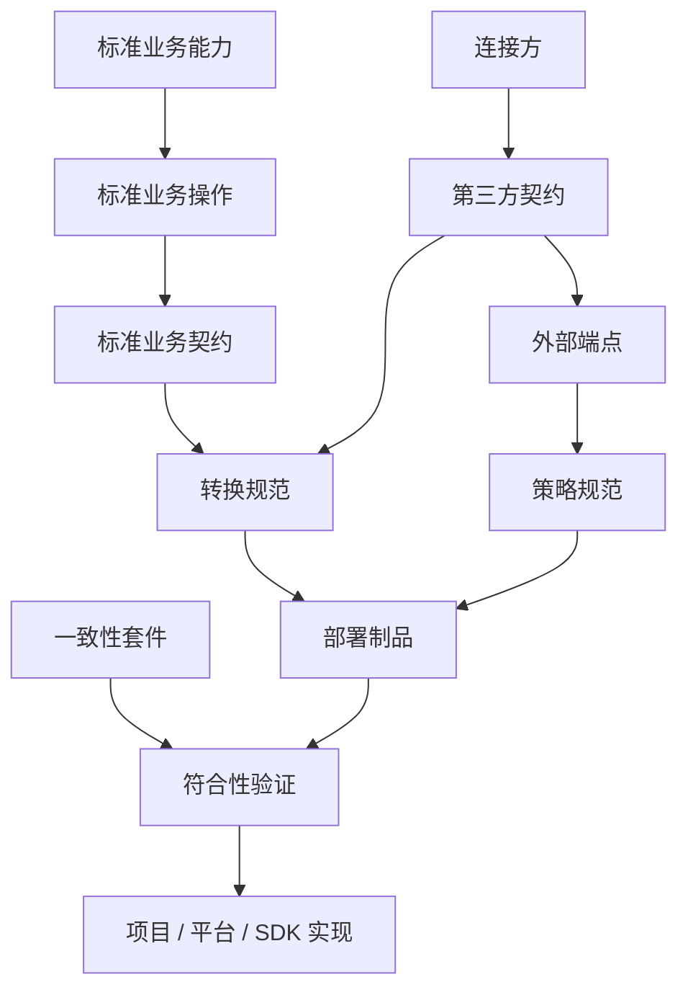

# 企业外部系统集成标准

> Enterprise External System Integration Standard（EESIS）

## 1. 文档信息

| 项目 | 内容 |
|---|---|
| 文档名称 | 企业外部系统集成标准 |
| 文档代号 | EESIS |
| 当前版本 | 0.1.0 |
| 状态 | `DRAFT_BASELINE`（基线草案） |
| 创建日期 | 2026-08-08 |
| 适用范围 | 企业内部所有业务系统、集成平台、渠道平台、供应商接入系统及第三方适配器 |
| 关联体系 | PCS 标准体系、EA 资产分类体系 |

### 1.1 文档定位

本标准定义企业业务系统接入渠道、供应商、合作伙伴及其他外部系统时应遵循的统一模型、契约、转换、策略、配置、运行和治理要求。

本标准不绑定具体项目、编程语言、技术框架、数据库或产品。项目可以采用不同技术实现，但必须满足本标准规定的语义、行为、生命周期、安全和一致性要求。

现有第三方接入原型可作为本标准的首个参考实现和迁移验证对象，但不得用现有项目结构反向限制标准边界。

### 1.2 规范性术语

本文使用以下约束等级：

- `MUST`：强制要求，符合本标准的实现必须满足。
- `MUST NOT`：强制禁止。
- `SHOULD`：推荐要求，例外时必须说明理由和影响。
- `SHOULD NOT`：原则上不应采用，例外时必须说明理由。
- `MAY`：可选能力，实现方可以根据场景决定。

### 1.3 基线管理

当前版本是架构基线草案，不代表已经完成组织级评审或正式发布。后续变更应保留：

- 变更原因；
- 影响范围；
- 兼容性判断；
- 迁移策略；
- 评审结论；
- 生效版本。

---

## 2. 目标与原则

### 2.1 建设目标

本标准旨在实现：

1. 业务系统面向稳定的企业标准契约，而不是直接依赖第三方报文。
2. 同一业务能力可以替换或并行接入多个供应商。
3. 通用接入能力由声明式配置、标准策略和可复用运行时承载。
4. 接口、映射、策略和凭证等配置具备完整的版本、发布和审计治理。
5. 项目能够通过一致性测试证明其实现符合标准。
6. 集成过程形成可识别、可治理、可复用的 PCS 与 EA 资产。

### 2.2 设计原则

1. **标准先于项目**：先定义企业契约和运行规则，项目按标准改造。
2. **业务语义稳定**：第三方字段、协议和产品变化不得直接扩散到业务系统。
3. **契约与实现分离**：标准规定行为，不强制具体 Java 类、表结构或产品。
4. **声明式优先**：常规差异通过配置表达，复杂差异通过受控扩展实现。
5. **版本不可变**：已发布资产不得原地修改，只能创建新版本。
6. **运行版本确定**：单次调用必须绑定唯一、确定且可追溯的配置版本。
7. **安全默认开启**：凭证保护、敏感字段脱敏和最小权限是默认要求。
8. **全链路可观测**：调用、转换、策略、错误和版本必须能够关联追踪。
9. **渐进式采用**：允许老系统通过适配层逐步迁移，不要求一次性重写。

---

## 3. 标准总体架构



### 3.1 语义标准层

定义企业如何表达业务能力、业务操作、字段含义、标准错误和业务事件。

### 3.2 契约标准层

定义标准请求、标准响应、第三方契约、数据类型、必填约束和兼容性规则。

### 3.3 转换标准层

定义标准契约与外部契约之间的字段、对象、数组、类型和错误转换方式。

### 3.4 策略标准层

定义认证、签名、加密、重试、限流、熔断、幂等、结果判定等可组合策略。

### 3.5 治理标准层

定义资产生命周期、测试、评审、审批、发布、回滚、权限和审计要求。

### 3.6 运行时标准层

定义配置装载、映射执行、策略执行、协议调用、缓存、版本绑定和可观测行为。

### 3.7 一致性认证层

定义一个项目、平台、SDK 或适配器如何证明其实现符合本标准。

---

## 4. 统一概念模型

### 4.1 核心概念

| 概念 | 英文名称 | 定义 |
|---|---|---|
| 标准业务能力 | Canonical Capability | 企业可识别、与具体供应商无关的业务能力 |
| 标准业务操作 | Canonical Operation | 业务能力下可独立调用或触发的操作 |
| 标准契约 | Canonical Contract | 企业内部稳定的请求、响应、事件和错误模型 |
| 第三方契约 | Provider Contract | 外部系统特定接口的请求、响应及回调模型 |
| 外部端点 | External Endpoint | 外部接口的地址、协议、方法、编码和网络属性 |
| 转换规范 | Mapping Specification | 标准契约与第三方契约之间的声明式转换定义 |
| 策略规范 | Policy Specification | 认证、签名、加密和调用控制等策略定义 |
| 连接方 | Provider | 渠道、供应商、合作伙伴或外部系统 |
| 部署制品 | Deployment Bundle | 某个确定版本可被运行时装载的完整集成配置 |
| 一致性套件 | Conformance Suite | 验证实现是否符合标准的测试规则及证据集合 |

### 4.2 关系模型



### 4.3 业务域组织原则

标准契约必须按照业务域和业务能力组织，不应建立覆盖全企业所有场景的单一超级模型。

示例：

```text
客户域
├── 实名核验
├── 联系方式核验
└── 企业认证

支付域
├── 支付下单
├── 支付查询
├── 退款
└── 支付通知

物流域
├── 运单创建
├── 轨迹查询
└── 物流状态事件
```

---

## 5. 标准业务契约规范

### 5.1 标准操作定义

每个标准业务操作 `MUST` 包含：

- 全局唯一的操作编码；
- 清晰且无供应商倾向的业务语义；
- 独立演进的契约版本；
- 标准请求模型；
- 标准响应模型；
- 标准错误模型；
- 涉及回调时的标准事件模型；
- 数据分类与敏感等级；
- 兼容性策略。

概念结构如下：

```text
CanonicalOperation
├── operationCode
├── operationVersion
├── semanticDefinition
├── requestContract
├── responseContract
├── errorContract
├── eventContract
├── dataClassification
└── compatibilityPolicy
```

### 5.2 契约表达

标准实现 `MAY` 使用 JSON Schema、OpenAPI Schema、Protobuf 或其他结构化契约语言，但必须能够表达：

- 字段名称和业务含义；
- 数据类型和格式；
- 是否必填；
- 枚举及值域；
- 对象和数组结构；
- 数据敏感等级；
- 示例和校验规则；
- 版本及兼容性信息。

### 5.3 兼容性要求

- 新增非必填字段通常视为向后兼容。
- 删除字段、修改字段类型、修改必填性或改变字段语义视为破坏性变更。
- 破坏性变更 `MUST` 提升主版本。
- 同一个字段名称 `MUST NOT` 在同一业务域内表达两个不同语义。
- 供应商特有字段 `MUST NOT` 未经治理直接进入标准契约。

---

## 6. 声明式报文转换规范

### 6.1 转换方向

标准转换引擎 `MUST` 支持以下概念方向：

| 方向 | 含义 |
|---|---|
| `OUTBOUND_REQUEST` | 标准业务请求转换为第三方请求 |
| `INBOUND_RESPONSE` | 第三方响应转换为标准业务响应 |
| `INBOUND_CALLBACK` | 第三方回调转换为标准业务事件 |
| `OUTBOUND_CALLBACK_RESPONSE` | 标准处理结果转换为第三方回调应答 |

### 6.2 转换规范模型

```text
TransformationSpecification
├── specificationCode
├── specificationVersion
├── sourceContract
├── targetContract
├── direction
├── mappingRules
├── conversionFunctions
├── validationRules
├── errorStrategy
└── lifecycleStatus
```

### 6.3 映射规则模型

每条映射规则 `MUST` 能够表达：

```text
MappingRule
├── ruleCode
├── sourceSelector
├── targetSelector
├── valueSource
├── targetType
├── converter
├── condition
├── required
├── defaultValue
├── arrayStrategy
├── missingStrategy
├── errorStrategy
└── executionOrder
```

### 6.4 值来源

实现至少 `MUST` 支持：

- `SELECTOR`：从源报文中选择值；
- `CONSTANT`：使用常量；
- `CONTEXT`：从标准运行上下文取值；
- `DEFAULT`：来源为空或缺失时使用默认值。

实现 `MAY` 支持受限表达式，但不得允许未经审批的任意代码执行。

标准运行上下文 `SHOULD` 包含：

- requestId；
- traceId；
- providerCode；
- operationCode；
- invocationTime；
- environment；
- tenantId（适用时）。

### 6.5 基础转换能力

符合标准的通用实现 `SHOULD` 提供：

- 字符串、数字、布尔值和日期时间转换；
- 枚举映射；
- 默认值；
- 字符串拼接和拆分；
- 小数精度转换；
- JSON 对象解析和序列化；
- 字典映射；
- 空值与缺失值处理；
- 嵌套对象映射；
- 数组逐项映射。

### 6.6 数组映射

数组映射必须使用父子规则或等价的结构化方式表达，不应把完整数组转换隐藏在不可治理的单条脚本中。

概念示例：

```text
父规则：$.data.records[*] -> $.items[*]
策略：EACH

子规则：
$.product_code -> $.productCode
$.product_name -> $.productName
$.qty          -> $.quantity
```

数组实现至少应明确：

- 空数组的处理方式；
- 单值与数组不匹配时的处理方式；
- 子项失败时是终止、忽略还是部分成功；
- 数组顺序是否保留；
- 最大元素数量和资源限制。

### 6.7 转换函数扩展

复杂转换 `MAY` 使用受控扩展函数。扩展函数必须：

- 具有唯一编码和版本；
- 明确输入、输出及副作用；
- 可测试、可审计；
- 经过安全检查和发布审批；
- 不得通过配置任意加载类或执行脚本；
- 不得直接读取未授权的系统资源或应用容器对象。

---

## 7. 路径选择器规范

### 7.1 抽象要求

标准使用 `Source Selector` 和 `Target Selector` 表达取值与写值，不将某个具体 JSONPath 库规定为唯一实现。

首个推荐的选择器规范为：

```text
JSONPath Profile 1.0
```

实现可以使用 Jayway JsonPath、Jackson Tree Model、JMESPath、XPath 或其他技术，只要通过相应选择器规范的一致性测试。

### 7.2 源选择器

JSON 源选择器 `SHOULD` 支持：

- 根节点 `$`；
- 对象属性访问；
- 数组索引；
- 数组遍历；
- 受控条件过滤。

### 7.3 目标选择器

目标选择器 `SHOULD` 采用受限、可确定的路径语法，至少支持：

- 对象路径，如 `$.customer.name`；
- 数组索引，如 `$.items[0].name`；
- 数组当前项，如 `$.items[*].name`。

目标写入实现 `MUST` 能够按规范创建缺失的中间对象或明确返回标准错误。目标路径不得使用行为不确定的任意过滤表达式。

### 7.4 编译与验证

- 发布前 `MUST` 校验所有选择器语法。
- 运行时 `SHOULD` 预编译选择器和转换计划。
- 单次请求执行期间 `MUST NOT` 因后台配置变化而切换转换版本。

---

## 8. 策略执行规范

### 8.1 策略类型

标准策略体系至少覆盖：

- 参数注入；
- 认证和令牌获取；
- 签名与验签；
- 加密与解密；
- 协议与报文编码；
- 超时和重试；
- 限流、隔离和熔断；
- 幂等和防重；
- 业务成功判定；
- 第三方错误标准化。

### 8.2 标准执行顺序


项目不得把签名、认证、重试或成功判定混入普通字段映射规则。确需调整顺序时，必须通过标准扩展点明确声明并评估安全影响。

---

## 9. 控制面标准

### 9.1 职责

标准控制面负责：

```text
控制面
├── 标准契约管理
├── 第三方契约管理
├── 外部端点管理
├── 转换规范管理
├── 策略规范管理
├── 环境参数管理
├── 凭证引用管理
├── 测试用例管理
├── 版本评审与审批
├── 发布与回滚
└── 资产关系与影响分析
```

### 9.2 生命周期

所有可发布配置 `MUST` 具有明确生命周期。推荐状态为：

```text
DRAFT -> TESTING -> APPROVED -> PUBLISHED -> DEPRECATED -> RETIRED
```

强制要求：

- `PUBLISHED` 版本 `MUST NOT` 原地修改；
- 新变更 `MUST` 产生新版本；
- 发布前 `MUST` 完成结构校验和规定的测试；
- 发布动作 `MUST` 记录操作者、时间、内容摘要和审批依据；
- 回滚 `MUST` 指向一个已验证的不可变版本；
- 删除历史版本 `MUST` 服从审计和数据留存策略。

### 9.3 部署制品

控制面应产生完整、不可变、可校验的集成部署制品：

```text
IntegrationDeploymentBundle
├── manifest
├── canonicalContract
├── providerContract
├── endpointSpecification
├── mappingSpecification
├── policySpecification
├── testEvidence
├── version
└── checksum
```

运行时应装载部署制品，而不是在执行过程中拼接多个状态不一致的活动配置。

---

## 10. 运行面标准

### 10.1 标准能力

```text
运行面
├── 部署制品装载器
├── 契约校验器
├── 映射执行器
├── 策略执行器
├── 协议执行器
├── 版本与缓存管理器
├── 扩展函数注册表
├── 错误标准化组件
└── 日志、指标、链路与审计组件
```

### 10.2 执行要求

- 单次调用 `MUST` 绑定确定的部署制品版本。
- 运行时 `MUST` 在结果和审计信息中保留实际版本标识。
- 运行时 `MUST NOT` 对每条字段规则单独访问配置数据库。
- 映射计划和策略计划 `SHOULD` 在发布或装载阶段完成校验和编译。
- 配置更新 `SHOULD` 原子切换，不得暴露半发布状态。
- 运行时 `MUST` 设置报文大小、数组长度、表达式复杂度和执行时间限制。

### 10.3 实现模式

符合标准的运行时可以采用：

- 企业统一集成平台；
- 独立部署的集成服务；
- 嵌入业务系统的标准 SDK；
- 网关插件；
- 项目自研但通过一致性认证的实现。

---

## 11. 标准错误与可观测性

### 11.1 错误分类

标准实现至少应区分：

```text
CONTRACT_VALIDATION_FAILED
DEPLOYMENT_BUNDLE_NOT_FOUND
CONFIGURATION_VERSION_INVALID
SOURCE_SELECTOR_NOT_FOUND
REQUIRED_VALUE_MISSING
VALUE_CONVERSION_FAILED
TARGET_WRITE_FAILED
ARRAY_MAPPING_FAILED
POLICY_EXECUTION_FAILED
AUTHENTICATION_FAILED
SIGNATURE_VERIFICATION_FAILED
ENCRYPTION_OR_DECRYPTION_FAILED
PROVIDER_TIMEOUT
PROVIDER_TRANSPORT_FAILED
PROVIDER_BUSINESS_FAILED
STANDARD_RESPONSE_VALIDATION_FAILED
```

### 11.2 标准错误上下文

错误上下文 `SHOULD` 包含：

- traceId 和 requestId；
- providerCode 和 operationCode；
- 部署制品版本；
- 映射规范和规则标识；
- 策略标识；
- 标准错误码；
- 可安全展示的错误摘要。

错误上下文 `MUST NOT` 未经脱敏记录凭证、密钥、身份证号、银行卡号或完整个人敏感数据。

### 11.3 可观测性

符合标准的运行时 `MUST` 支持：

- 结构化日志；
- 调用量、成功率、错误率和耗时指标；
- 分布式链路标识；
- 配置版本追踪；
- 第三方和标准错误分类统计；
- 发布前后效果对比；
- 关键管理动作审计。

---

## 12. 安全与合规

### 12.1 凭证管理

- 凭证和密钥 `MUST NOT` 以明文形式存储在普通业务配置表中。
- 配置中 `SHOULD` 保存密钥引用，而不是密钥值。
- 密钥读取必须遵循最小权限和环境隔离。
- 凭证查看、更新和使用必须可审计。
- 凭证必须支持轮换，且不要求修改映射规范或业务契约。

### 12.2 数据保护

- 标准契约字段 `MUST` 标注数据分类和敏感等级。
- 日志、测试样例和审计证据必须按分类执行脱敏。
- 生产报文不得未经授权直接复制为测试数据。
- 测试用例 `SHOULD` 使用合成数据或经过批准的脱敏数据。
- 原始报文留存周期必须可配置并符合合规要求。

### 12.3 扩展安全

- `MUST NOT` 通过数据库配置任意 Java 类名并动态执行。
- `MUST NOT` 默认开放任意 Groovy、JavaScript 或其他脚本权限。
- 受控扩展必须具有注册、版本、审批、隔离和资源限制。
- 扩展不得直接获取完整应用容器或未授权系统资源。

---

## 13. 项目符合性与迁移

### 13.1 项目责任

采用本标准的项目必须：

1. 识别所使用的标准业务能力和操作。
2. 将项目内部模型适配到标准契约。
3. 注册并版本化第三方契约和外部端点。
4. 使用标准转换规范描述内外部契约差异。
5. 使用标准策略或经过认证的扩展处理认证、签名和加密。
6. 通过规定的一致性测试。
7. 生成并使用不可变部署制品。
8. 接入统一错误、审计和可观测体系。

### 13.2 老系统迁移模式

老系统 `MAY` 通过防腐适配层渐进迁移：


迁移顺序建议为：

1. 建立调用清单和依赖关系。
2. 提取标准业务操作和契约。
3. 将硬编码字段转换迁移为映射规范。
4. 将认证、签名和加密迁移为受控策略。
5. 建立配置版本和发布流程。
6. 引入标准错误及可观测性。
7. 执行回归、双跑或灰度验证。
8. 下线被替代的硬编码实现。

### 13.3 一致性等级

可按成熟度设置符合性等级：

| 等级 | 要求 |
|---|---|
| L1 契约符合 | 使用标准业务操作、契约和错误模型 |
| L2 转换符合 | 使用版本化声明式转换规范 |
| L3 运行符合 | 策略、版本、错误和运行时行为符合标准 |
| L4 治理符合 | 完成审批、发布、审计、可观测和一致性认证 |

只有达到组织规定的最低等级后，项目才能声明“符合 EESIS”。

---

## 14. PCS 与 EA 双体系定位

### 14.1 EA 资产视角

EA 体系描述本标准及其资产在企业架构中的位置：

- 业务能力：外部生态连接、渠道接入、供应商协同；
- 应用能力：协议适配、报文转换、策略执行、配置治理；
- 数据资产：标准业务模型、字段语义、数据分类；
- 技术能力：映射引擎、策略引擎、统一集成运行时；
- 关系资产：系统、接口、供应商、标准版本和责任主体之间的关系。

EA 主要回答：它是什么、服务什么能力、由谁负责、与哪些系统和资产有关。

### 14.2 PCS 标准视角

PCS 体系规范本标准能力如何被工程化、交付、验证和复用，包括：

- 标准契约组件；
- 映射执行组件；
- 协议执行组件；
- 策略扩展接口；
- 配置发布组件；
- 一致性测试组件；
- SDK 和适配器模板；
- Spring Boot 等参考实现；
- 发布制品和验证证据。

PCS 主要回答：它如何被标准化实现、交付、验证和复用。

### 14.3 联邦关系

同一个集成能力可以同时具有 EA 与 PCS 分类。两套分类是不同观察维度，不应互相替代，也不要求一个资产只能属于一个分类。

---

## 15. 标准强制要求摘要

以下要求构成当前基线的最低约束：

1. `MUST` 使用与供应商无关的标准业务操作和标准契约隔离业务系统。
2. `MUST` 对标准契约、第三方契约、映射和策略进行版本管理。
3. `MUST` 保证已发布版本不可变。
4. `MUST` 保证单次调用绑定唯一部署制品版本。
5. `MUST` 明确区分字段转换、认证、签名、加密、重试和成功判定。
6. `MUST` 在发布前验证选择器、转换函数和契约结构。
7. `MUST` 使用标准错误分类，并保留可追溯上下文。
8. `MUST NOT` 在普通配置或日志中存储、输出明文凭证和敏感数据。
9. `MUST NOT` 通过配置任意执行类或脚本。
10. `MUST` 记录发布、回滚、权限和关键配置变更审计证据。
11. `SHOULD` 预编译并缓存转换和策略执行计划。
12. `SHOULD` 通过一致性测试证明实现符合标准。

---

## 16. 标准文档体系规划

本总体标准后续可拆分为以下规范：

```text
01-企业外部系统集成总体标准.md
02-标准业务契约规范.md
03-声明式报文转换规范.md
04-路径选择器JSONPath规范.md
05-认证签名与加解密策略规范.md
06-错误标准化规范.md
07-配置版本发布与回滚规范.md
08-运行时接口规范.md
09-安全审计与可观测性规范.md
10-标准一致性测试规范.md
11-旧系统适配与迁移指南.md
12-Spring-Boot参考实现规范.md
```

总体标准定义原则、边界和强制要求；子规范定义某一主题的详细行为；参考实现规范描述特定技术栈如何实现，不得反向改变总体标准语义。

---

## 17. 推进路线

### 第一阶段：标准基线

- 评审统一概念模型和标准边界；
- 选择首批业务能力进行标准契约建模；
- 完成声明式转换和 JSONPath Profile 1.0 子规范；
- 定义标准错误、版本和发布规则。

### 第二阶段：参考实现

- 将现有第三方接入原型升级为首个参考实现；
- 实现标准契约、双向映射、受控转换器和策略链；
- 建立配置编译、缓存、发布和回滚能力；
- 以现有典型接口构建回归样例。

### 第三阶段：项目验证

- 选择至少一个新项目和一个老项目验证；
- 建立适配、双跑、灰度和回滚流程；
- 收集标准缺口，但不得用单项目特例污染通用模型。

### 第四阶段：组织治理

- 发布正式标准版本；
- 建立标准评审委员会或责任人机制；
- 建立 PCS 组件认证和 EA 资产登记；
- 建立一致性测试、度量和持续演进机制。

---

## 18. 待评审事项

以下内容需要在正式发布前形成组织决策：

1. 标准的治理责任主体和审批人；
2. 首批纳入的业务域和标准业务操作；
3. 标准契约的主表达语言；
4. JSONPath Profile 1.0 支持的精确语法范围；
5. 配置发布、灰度和回滚的组织流程；
6. 凭证中心和密钥引用机制；
7. 一致性等级的最低准入要求；
8. PCS 组件登记及认证规则；
9. EA 资产编码和关系绑定规则；
10. 现有原型作为参考实现的改造边界和路线。

---

## 19. 结论

企业外部系统集成不应被视为某个项目中的 HTTP 封装或字段映射功能，而应被建设为跨业务域、跨项目、跨供应商复用的企业标准能力。

本标准以稳定的企业业务语义和标准契约为核心，通过声明式报文转换、可组合策略、版本化部署制品、标准运行时和一致性治理隔离第三方差异。具体项目是标准的实现者和使用者，现有第三方接入原型是首个参考实现候选，但标准的生命周期和边界独立于任何单一项目。

