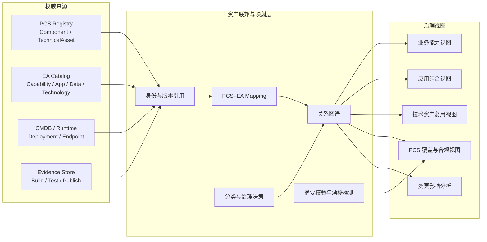

# PCS–EA 双体系资产治理建设方案

> 文档状态：`DRAFT_NON_NORMATIVE`  
> 文档版本：`0.1`  
> 用途：架构讨论、方案评审与后续规划参考  
> 权威声明：本文不是 Accepted PCS Standard、Accepted Target、Task Input 2.0、发布授权或合规证明。任何正式 PCS Business Component 或 TechnicalAsset 的设计、物化、重构、验证与发布，均须由对应 Accepted authority 独立授权。

## 1. 背景

企业资产治理中存在两类不同但互补的诉求：

- PCS 关注一个 Business Component 或 TechnicalAsset 能否被明确所有、设计、实现、验证、发布和复用。
- EA 关注企业拥有哪些业务能力、业务服务、应用、数据、技术以及它们之间的关系。

单独使用 PCS，无法完整覆盖外部服务、应用组合、运行实例、数据流和架构依赖；单独使用 EA，又无法表达 PCS 对所有权、契约、版本、血缘、发布状态和证据链的严格要求。

因此，本方案建议建立：

> 两套资产体系、一层权威映射、三类事实分治。

```text
PCS：规范、契约、版本、发布和证据事实
EA：能力、应用、数据、技术和关系事实
运行态：部署、端点、健康、容量和使用事实
```

运行态事实可由 CMDB、交付平台和可观测平台提供，不必再定义第三套资产标准。

## 2. 建设目标

- PCS 与 EA 保持独立权威和独立生命周期。
- 一个现实对象可以具有多个 EA 分类。
- 只有满足严格条件的对象才进入 PCS。
- 一个 PCS 资产可以映射多个 EA 对象。
- 一个 EA 应用或平台可以装配多个 PCS 资产。
- 支持从业务能力追踪到业务组件、技术资产、部署实例和运行状态。
- 支持影响分析、重复建设发现、生命周期治理和技术资产复用。
- 防止 EA 分类反向改变 PCS 的所有权、契约、Accepted 状态或发布血缘。

## 3. 核心原则

### 3.1 双权威原则

PCS 是 PCS 字段的唯一权威；EA 是架构分类和架构关系的唯一权威。双方通过引用和映射协作，不复制和争夺对方的规范字段。

### 3.2 生命周期独立原则

PCS 生命周期、EA 生命周期和运行状态分别保存，不得互相推导。

### 3.3 最小资产化原则

配置、日志、密钥、部署实例和内部实现细节，不因具有治理价值就自动成为 PCS 资产。

### 3.4 所有权不可转移原则

业务组件契约不能仅通过重命名或技术实现位置变化而转移给 TechnicalAsset。所有权变化必须由 Accepted contract decision 或 amendment 授权。

### 3.5 发布资产不可原地修改原则

已发布 PCS 资产只能通过 controlled revision、published successor 或 derived asset 演进，并保留稳定 ID、版本和血缘证据。

## 4. 总体架构



### 4.1 权威数据流

```text
PCS → EA：只读投影 Component/TechnicalAsset 的 ID、版本、状态和摘要
EA → PCS：提交候选、影响信息和分类建议，不能直接改写 PCS
CMDB → EA：同步部署实例、运行端点和依赖关系
证据平台 → PCS：提供构建、测试、发布和消费证据
```

EA 不得直接修改：

- PCS Asset ID 或 Component ID。
- TechnicalAsset Kind。
- PCS 契约所有权。
- Accepted 状态。
- PCS 生命周期。
- Supersession 或 Derived 血缘。

## 5. 体系边界

### 5.1 PCS 管理范围

适合进入 PCS 的对象包括：

- 具有明确 DDD 边界的 Business Component。
- 具有独立 SPI、Provider 或 Bridge 责任的 TechnicalAsset。
- 具有稳定契约和明确所有者的能力。
- 有命名消费者的可复用技术能力。
- 可以独立版本、验证、发布或被选择的资产。
- 受控 successor 或 derived asset。

PCS 不负责建立企业全景目录。

### 5.2 EA 管理范围

EA 应管理：

- 业务能力与业务服务。
- 应用、平台与应用组件。
- 数据对象、数据流与数据等级。
- 技术服务和技术组件。
- 外部供应商、外部 API 和集成端点。
- 部署与依赖关系。
- 成本、风险、关键度和生命周期。

EA 对象不一定是 PCS 资产。

### 5.3 非独立资产对象

以下对象通常作为配置、运行数据或证据管理：

- 密钥、证书和凭证。
- 环境参数。
- Redis nonce。
- 调用日志和 Trace。
- 临时任务和运行告警。
- 普通数据库记录。
- 没有稳定消费者契约的内部实现类。

## 6. 核心元模型

建议采用联邦模型，不建设一个同时拥有 PCS 与 EA 全部字段的“大一统资产表”。

### 6.1 EA 对象

```text
ea_object
├── ea_object_id
├── object_type
├── name
├── business_domain
├── owner
├── lifecycle_state
├── criticality
├── data_classification
├── source_system
└── source_reference
```

建议的 EA 对象类型：

```text
BUSINESS_CAPABILITY
BUSINESS_SERVICE
APPLICATION
APPLICATION_COMPONENT
DATA_OBJECT
TECHNOLOGY_SERVICE
TECHNOLOGY_COMPONENT
EXTERNAL_SERVICE
DEPLOYMENT
ENDPOINT
```

### 6.2 PCS 权威引用

```text
pcs_asset_reference
├── pcs_asset_id
├── asset_kind
├── asset_version
├── authority_uri
├── authority_digest
├── accepted_state
├── publication_state
├── supersedes
└── synchronized_at
```

该模型只保存 PCS 权威引用和摘要，不复制 PCS 标准正文。

### 6.3 PCS–EA 映射

```text
ea_pcs_mapping
├── mapping_id
├── ea_object_id
├── pcs_asset_id
├── pcs_asset_version
├── relation_type
├── mapping_status
├── decision_reference
├── effective_from
└── effective_to
```

推荐关系类型：

```text
REALIZED_BY
IMPLEMENTED_BY
GOVERNED_BY
ASSEMBLES
USES
PROVIDES
EXPOSES
DEPLOYED_AS
DERIVED_FROM
REPLACED_BY
```

### 6.4 通用关系图谱

```text
asset_relation
├── source_type
├── source_id
├── relation_type
├── target_type
├── target_id
├── evidence_reference
└── effective_period
```

第一阶段可以使用关系型数据库实现。只有当关系规模和查询复杂度达到明确瓶颈后，再评估图数据库。

## 7. 生命周期模型

### 7.1 PCS 生命周期

```text
DESIGNED
MATERIALIZED
BUILT
TESTED
LOCAL_RUNTIME_VERIFIED
SELECTABLE
PUBLISHED
PRODUCTION_ELIGIBLE
```

### 7.2 EA 生命周期

```text
PROPOSED
PLANNED
ACTIVE
DEPRECATED
RETIRED
```

### 7.3 运行状态

```text
NOT_DEPLOYED
DEPLOYED
RUNNING
DEGRADED
STOPPED
```

禁止以下推导：

```text
PUBLISHED ≠ 已投产
ACTIVE ≠ PCS 合规
RUNNING ≠ 可复用 TechnicalAsset
BUILT ≠ TESTED
TESTED ≠ SELECTABLE
```

## 8. 治理流程

### 8.1 新对象进入流程

```text
发现对象
→ 登记 EA
→ 判断 PCS 适用性
→ 确定所有权
→ 确定资产种类
→ 执行独立 PCS 流程
→ Accepted 后建立映射
→ 同步版本和摘要
```

### 8.2 PCS 适用状态

```text
PCS_NOT_APPLICABLE
PCS_CANDIDATE
PCS_ASSESSING
PCS_MAPPING_PENDING
PCS_LINKED
PCS_NON_CONFORMANT
PCS_SUPERSEDED
```

EA 中的 PCS 适用状态只表达覆盖情况，不能代替 PCS 生命周期。

### 8.3 PCS 适用性判断

一个对象满足以下大部分条件时，才进入 PCS 候选流程：

1. 有明确且唯一的所有者。
2. 有稳定、独立的契约。
3. 有独立业务边界或技术责任。
4. 有明确的命名消费者。
5. 需要独立版本与兼容性治理。
6. 能独立构建或验证。
7. 能独立发布或被选择。
8. 不是纯配置、日志或部署实例。

### 8.4 PCS 版本同步

```text
PCS 产生新版本
→ 发布权威事件
→ EA 校验 Asset ID、版本和摘要
→ 关闭旧版本映射有效期
→ 建立新版本映射
→ 执行 EA 影响分析
```

EA 中发现的架构问题只能触发 PCS 候选变更、controlled revision、published successor、derived asset 或 Accepted amendment，不能直接改写已发布资产。

## 9. 角色与职责

| 角色 | 责任 |
|---|---|
| PCS Standards Owner | PCS 标准、状态和验证规则 |
| Component Owner | Business Component 边界和业务契约 |
| TechnicalAsset Owner | SPI、Provider、版本和消费者契约 |
| EA Owner | EA 元模型、分类原则和架构关系 |
| Mapping Steward | PCS–EA 映射审核 |
| Platform Owner | 资产平台建设与运行 |
| Security Owner | 凭证、数据等级和权限规则 |
| Evidence Owner | 构建、测试、发布和运行证据 |

同一个人可以承担多个角色，但平台中应分别记录每项责任。

## 10. 平台功能规划

### 10.1 第一阶段能力

- EA 对象登记。
- PCS 权威引用导入。
- PCS–EA 映射管理。
- 生命周期独立展示。
- 关系查询与所有权查询。
- 版本和摘要漂移检测。
- 映射审核和审计记录。
- PCS 覆盖状态。
- 基础影响分析。

### 10.2 第二阶段能力

- 业务能力地图。
- 应用组合视图。
- 技术资产复用视图。
- 重复技术能力识别。
- 已发布但无消费者资产识别。
- 生产运行但未纳入 PCS 治理对象识别。
- 已废弃 PCS 资产生产依赖识别。
- CI/CD、制品库、CMDB 和可观测平台集成。

### 10.3 暂不建设

- 大而全的 CMDB。
- 自动修改或接受 PCS。
- 自动把所有 EA 对象转成 PCS。
- 自动判定契约所有权。
- 使用 AI 直接发布 PCS 资产。
- 将日志、密钥和临时运行数据资产化。

## 11. 第三方接入系统试点

第三方接入系统同时包含业务组件候选、TechnicalAsset 候选、EA 平台对象和运行配置，适合作为首个试点。

### 11.1 EA 侧候选分类

```text
应用平台
└── 第三方集成平台

外部服务
├── 仓储服务供应商
├── 企业数据服务供应商
├── 云服务供应商
├── 融资数据服务供应商
└── 短信服务供应商

技术服务
├── HTTP 集成执行
├── 签名与加密
├── 报文转换
└── 动态配置发布

数据对象
├── 合作方
├── 外部服务定义
├── 环境配置
└── 调用记录
```

### 11.2 PCS 候选评估对象

```text
Business Component 候选
└── 第三方服务接入管理

TechnicalAsset 候选
├── 声明式 HTTP 集成运行时
├── Integration Policy Engine
├── Integration Client Bridge
└── 特殊 SDK Provider
```

以上对象仅为候选，不在本文中分配正式 Component ID 或 TechnicalAsset ID。

### 11.3 试点验收条件

- 现有服务全部完成 EA 登记或明确排除原因。
- 每个 PCS 候选都有所有权判断。
- 不把供应商 API 错当企业 Business Component。
- 不把凭证、日志和环境实例错当 PCS 资产。
- 能从业务能力追踪到应用、技术资产和运行端点。
- 能识别仍在使用已废弃技术资产的服务。
- PCS 与 EA 状态互不覆盖。
- PCS 引用可以校验版本和摘要。

## 12. 分阶段路线

### 阶段 0：权威与术语对齐

建议周期：1～2 周。

交付物：

- PCS 与 EA 术语对照表。
- 权威矩阵。
- 生命周期矩阵。
- PCS 适用性判断规则。
- 映射关系标准。
- 第三方接入试点范围。
- Accepted authority 清单。

退出条件：参与者对“什么是 PCS、什么是 EA、什么不是资产”达成一致。

### 阶段 1：元模型与治理流程

建议周期：2～3 周。

交付物：

- EA 元模型。
- PCS 引用模型。
- 映射模型。
- 关系模型。
- 审核流程和权限模型。
- 同步与漂移检测规则。
- API/Event 契约草案。

退出条件：使用样例数据完成端到端建模评审。

### 阶段 2：最小可用平台

建议周期：4～6 周。

交付物：

- EA 对象管理。
- PCS 只读导入。
- 映射工作台。
- 关系查询。
- 版本和摘要校验。
- 审核审计。
- PCS 覆盖视图。
- 基础影响分析。

退出条件：能够承载第三方接入系统完整试点。

### 阶段 3：第三方接入试点

建议周期：3～4 周。

交付物：

- 原型资产清单。
- PCS 候选判定。
- EA 分类结果。
- PCS–EA 映射。
- 关系图谱。
- 治理问题清单。
- 标准调整建议。

退出条件：试点结果通过 PCS Owner、EA Owner 和相关业务负责人联合评审。

### 阶段 4：企业推广

- 接入制品库、CI/CD、CMDB 和可观测平台。
- 建立架构合规门禁。
- 建立资产复用、版本升级和退役治理。
- 逐步扩展到其他业务域和技术平台。

## 13. 建设指标

- EA 对象 PCS 适用性判定覆盖率。
- PCS 资产 EA 映射率。
- 无所有者资产数量。
- PCS 引用摘要漂移数量。
- 已废弃资产生产依赖数量。
- 已发布但无命名消费者资产数量。
- 重复技术能力数量。
- 生产运行但未治理对象数量。
- 映射审核平均周期。
- 资产关系完整率。

这些指标用于发现治理问题，不得自动决定 PCS 合规状态。

## 14. 关键风险与控制

| 风险 | 控制措施 |
|---|---|
| EA 反向修改 PCS | PCS 字段只读并保留权威摘要 |
| 两边重复建模 | 只保存引用和映射，不复制正文 |
| 所有内容都 PCS 化 | 设置严格 PCS 适用性判断 |
| 一个系统打包成一个 PCS 资产 | 按责任、所有权和契约拆分 |
| 生命周期混用 | PCS、EA、运行状态分别存储 |
| 自动分类错误 | 自动化只提供建议，由 Owner 审核 |
| 映射长期失效 | 版本、摘要和有效期检测 |
| 建设成大而全 CMDB | 首期聚焦资产联邦与治理 |

## 15. PCS 工程状态声明

### Engineering Discovery Report

当前方案属于跨 PCS 与 EA 的治理设计，不是单个 Business Component 或 TechnicalAsset 的工程任务。第三方接入原型包含混合所有权，需要拆分后逐项确定工程模式。

### Authority Resolution Record

当前没有可验证的 Accepted PCS Standards Baseline、Accepted Target、Toolchain Lock 或 canonical Task Input 2.0。权威状态为 `SBE-AUTHORITY-MISSING`。

### Engineering Plan and Change Set

本文仅包含候选建设路线，不包含 PCS 文件级 Change Set、计划指纹、G1/G2 Apply envelope 或发布授权。

### Materialization or Refactor Result

未执行 Business Component 或 TechnicalAsset 的物化、重构、构建、发布和生产变更。

### Validation Report

尚未进入独立的架构验证、PCS 验证、契约测试、Binding 验证或消费者验证阶段。

### Evidence Index

本方案参考了第三方接入原型的源码分析、数据库结构和只读数据统计。这些材料属于发现证据，不是 Accepted authority。

### Residual Scope

后续需要补充：

- Accepted PCS Standards Baseline。
- Accepted Business Component 与 TechnicalAsset 样例或 Schema。
- 权威所有权模型。
- 目标资产的发布状态和血缘。
- Toolchain Lock。
- 对应模式的 canonical Task Input 2.0。

完成权威解析后，才能将本方案拆分为正式的 `NEW_BUSINESS_COMPONENT`、`NEW_TECHNICAL_ASSET`、`REFACTOR_EXISTING_COMPONENT` 或 `REFACTOR_EXISTING_TECHNICAL_ASSET` 独立任务。

