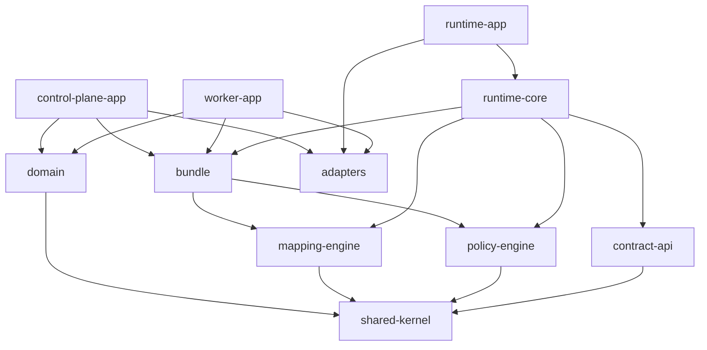
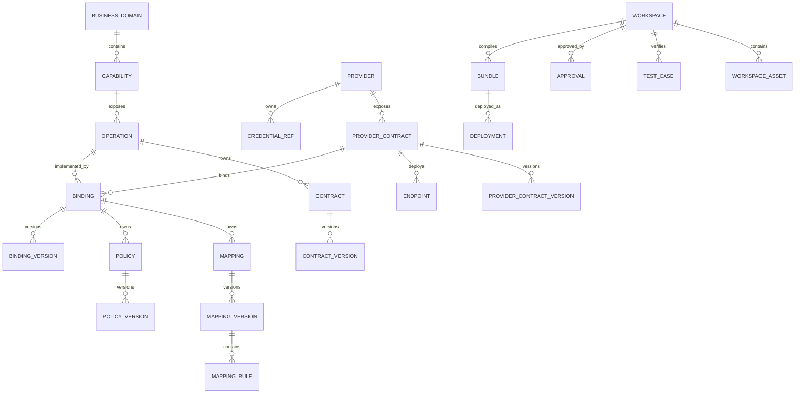

# 第三方集成平台工程落地详细设计

## 1. 文档信息

| 项目 | 内容 |
|---|---|
| 当前版本 | 0.1.0 |
| 状态 | `DRAFT_ENGINEERING_BASELINE` |
| 创建日期 | 2026-08-08 |
| 上位标准 | EESIS《企业外部系统集成标准》 |
| 架构依据 | 《第三方集成平台重设计方案》0.2.0 |
| 实施依据 | 《第三方集成平台落地实施计划》0.1.0 |

本文补齐可以直接开始编码的工程目录、模块依赖、包结构、核心接口、数据库模型和首个纵向闭环实施顺序。

---

## 2. 已有文档覆盖情况

之前的文档并非没有这些内容，但粒度不同：

| 内容 | 已有位置 | 完整度 |
|---|---|---|
| 总体Maven模块方向 | 重设计方案第19章 | 架构级 |
| 逻辑表组 | 重设计方案第12章 | 只有表组，没有完整字段和约束 |
| 配置和发布流程 | 重设计方案第13章 | 完整流程 |
| Policy DSL | 重设计方案第14章 | 语言与运行模型 |
| 分阶段计划 | 实施计划第3～11章 | 已有 |
| 首批工程工作包 | 实施计划第13章 | 已有 |
| 可执行MySQL DDL | 本文及配套SQL | 本次新增 |
| 精简后的AI交付目录 | 本文 | 本次新增 |

因此已有方案不需要推翻，本设计负责把它物理化。

---

## 3. 技术基线

首期参考实现建议：

| 类别 | 建议 |
|---|---|
| Java | Java LTS，建议Java 21 |
| 应用框架 | Spring Boot 3系列组织批准版本 |
| 构建 | Maven多模块 |
| 数据库 | MySQL 8.x |
| 数据库迁移 | Flyway |
| JSON模型 | Jackson `JsonNode` |
| Schema | JSON Schema 2020-12兼容实现 |
| 源选择器 | JSONPath Profile 1.0 |
| 条件表达式 | CEL安全子集或等价受限表达式 |
| HTTP | Spring HTTP Client或组织统一客户端适配器 |
| 稳定性 | Resilience策略适配层，避免领域代码绑定具体库 |
| 可观测 | Micrometer + OpenTelemetry兼容方案 |
| Secret | 企业Secret Manager/KMS，通过Port适配 |

具体第三方库版本在工程Spike后锁定到BOM，不在本设计中固定次版本。

---

## 4. 仓库目录

考虑“你+Codex”的交付模式，首期不拆成二十多个细模块，先采用13个边界清晰的Maven模块：

```text
third-party-integration-platform/
├── pom.xml
├── README.md
├── AGENTS.md
├── docs/
│   ├── architecture/
│   ├── adr/
│   ├── api/
│   ├── policy-dsl/
│   └── runbook/
├── database/
│   ├── migration/
│   │   ├── V1__tpip_core_schema.sql
│   │   ├── V2__tpip_seed_policy_types.sql
│   │   └── V3__tpip_runtime_tables.sql
│   └── migration-test/
├── deployment/
│   ├── docker/
│   ├── compose/
│   ├── kubernetes/
│   └── observability/
├── tpip-bom/
├── tpip-shared-kernel/
├── tpip-contract-api/
├── tpip-domain/
├── tpip-mapping-engine/
├── tpip-policy-engine/
├── tpip-bundle/
├── tpip-runtime-core/
├── tpip-adapters/
├── tpip-control-plane-app/
├── tpip-runtime-app/
├── tpip-worker-app/
└── tpip-test-kit/
```

### 4.1 为什么先用13个模块

- 保持Domain、Compiler、Runtime、Adapter和App边界；
- 减少单人+Codex模式下的模块维护成本；
- 后续某个领域需要独立交付时，可从`tpip-domain`中拆出；
- 控制面和运行面已经是独立部署单元，不要求所有代码都独立部署。

---

## 5. Maven模块职责

### 5.1 `tpip-bom`

统一依赖版本，不包含业务代码。

### 5.2 `tpip-shared-kernel`

只允许放稳定且小型的共享概念：

```text
AssetCode
SemanticVersion
EnvironmentCode
LifecycleStatus
TraceContext
DomainError
PageQuery
```

禁止将通用Service、DAO、Spring工具类堆入Shared Kernel。

### 5.3 `tpip-contract-api`

对调用方公开的标准API模型：

```text
InvocationRequest
InvocationResponse
InvocationMeta
StandardResult
StandardError
AsyncJobResponse
CallbackAck
```

不暴露JPA Entity和控制面内部模型。

### 5.4 `tpip-domain`

包含六个领域包：

```text
com.company.tpip
├── catalog
├── provider
├── integration
├── release
├── verification
└── governance
```

每个领域内部结构：

```text
catalog/
├── domain/
│   ├── model/
│   ├── service/
│   ├── event/
│   └── repository/
├── application/
│   ├── command/
│   ├── query/
│   └── service/
└── port/
    ├── in/
    └── out/
```

### 5.5 `tpip-mapping-engine`

```text
com.company.tpip.mapping
├── api/
├── compiler/
├── ir/
├── selector/
├── writer/
├── converter/
├── runtime/
├── diagnostics/
└── validation/
```

核心接口：

```java
public interface MappingCompiler {
    CompiledMappingPlan compile(MappingSpecification specification);
}

public interface MappingEngine {
    MappingResult transform(
        CompiledMappingPlan plan,
        JsonNode source,
        MappingContext context
    );
}
```

### 5.6 `tpip-policy-engine`

```text
com.company.tpip.policy
├── api/
├── schema/
├── compiler/
├── expression/
├── ir/
├── registry/
├── builtin/
├── runtime/
└── diagnostics/
```

核心接口：

```java
public interface PolicyCompiler {
    CompiledPolicyPlan compile(PolicyDocument document);
}

public interface PolicyExecutor {
    PolicyExecutionResult execute(
        PolicyStage stage,
        CompiledPolicyPlan plan,
        InvocationContext context
    );
}
```

### 5.7 `tpip-bundle`

负责：

- Bundle Manifest；
- 资产依赖闭包；
- Mapping/Policy编译协调；
- checksum和制品签名；
- 序列化、兼容性和装载验证。

### 5.8 `tpip-runtime-core`

```text
com.company.tpip.runtime
├── invocation/
├── resolver/
├── routing/
├── pipeline/
├── transport/
├── callback/
├── idempotency/
├── bundle/
└── observability/
```

运行时依赖`contract-api`、`mapping-engine`、`policy-engine`和`bundle`，不依赖控制面App。

### 5.9 `tpip-adapters`

统一放技术适配器，按子包隔离：

```text
adapter/
├── persistence/mysql/
├── transport/http/
├── secret/
├── artifact/
├── event/
├── cache/
└── observability/
```

领域层通过Port依赖这些能力，不能直接依赖具体实现。

### 5.10 三个应用

- `tpip-control-plane-app`：配置、测试、审批、发布和管理API。
- `tpip-runtime-app`：同步调用和第三方回调入口。
- `tpip-worker-app`：异步作业、回归测试、Bundle分发等；首期可暂不部署。

### 5.11 `tpip-test-kit`

包含：

- Provider Mock；
- Contract Fixture；
- Mapping Fixture；
- Policy Fixture；
- Bundle Builder；
- 新旧结果比较器；
- Testcontainers集成测试支持。

---

## 6. 模块依赖规则



强制规则：

- Domain不得依赖Spring MVC、JPA Entity或HTTP Client；
- Mapping Engine不得访问数据库、Secret或网络；
- Policy表达式不得直接读取Secret值；
- Runtime不得读取设计态表，只装载已发布Bundle；
- Control Plane不得出现在在线调用链路；
- App模块只做装配和入口，不承载核心规则。

---

## 7. 首批API

### 7.1 运行时API

```text
POST /integration/v1/operations/{operationCode}:invoke
POST /integration/v1/operations/{operationCode}:submit
GET  /integration/v1/jobs/{jobId}
POST /integration/v1/callbacks/{callbackRouteKey}
GET  /actuator/health
GET  /actuator/prometheus
```

### 7.2 控制面API

```text
/control/v1/domains
/control/v1/capabilities
/control/v1/operations
/control/v1/contracts
/control/v1/providers
/control/v1/provider-contracts
/control/v1/endpoints
/control/v1/bindings
/control/v1/mappings
/control/v1/policies
/control/v1/workspaces
/control/v1/verifications
/control/v1/release-candidates
/control/v1/bundles
/control/v1/deployments
```

命令型接口使用明确动作，例如：

```text
POST /control/v1/workspaces/{id}:validate
POST /control/v1/workspaces/{id}:submit-review
POST /control/v1/release-candidates/{id}:approve
POST /control/v1/release-candidates/{id}:compile
POST /control/v1/bundles/{id}:deploy
POST /control/v1/deployments/{id}:rollback
```

---

## 8. 数据库总体设计

### 8.1 数据库建议

新平台使用独立数据库，例如：

```text
tpip_platform
```

不建议继续直接使用`fashioncloud_related`作为新运行时数据库。旧库作为迁移数据源，完成清洗后导入配置工作区。

### 8.2 表命名

统一使用`tpip_`前缀，按资产而不是按JPA类命名。

### 8.3 四类数据

| 类型 | 表 | 说明 |
|---|---|---|
| 定义表 | operation、provider、mapping、policy等 | 稳定身份和编码 |
| 版本表 | contract_version、binding_version等 | 不可变版本内容 |
| 发布表 | workspace、bundle、deployment等 | 配置交付过程 |
| 运行表 | idempotency、callback_record等 | 高频运行数据 |

### 8.4 关键设计规则

- 定义表和版本表分离；
- 已发布版本不允许UPDATE业务内容；
- JSON存储Schema、Policy DSL和Manifest等结构化文档；
- 需要检索和约束的字段必须独立成列；
- Secret只保存URI引用；
- Bundle只引用发布快照和制品URI；
- 生产Runtime不读取Mapping Rule等设计表；
- 审计表只追加；
- 运行时高频数据设置归档和清理策略。

---

## 9. 核心表清单

### 9.1 Catalog

| 表 | 用途 |
|---|---|
| `tpip_business_domain` | 业务域 |
| `tpip_capability` | 标准业务能力 |
| `tpip_operation` | 标准业务操作 |
| `tpip_contract` | 标准契约稳定身份 |
| `tpip_contract_version` | 标准请求、响应、错误、事件Schema版本 |

### 9.2 Provider

| 表 | 用途 |
|---|---|
| `tpip_provider` | 第三方、渠道或供应商 |
| `tpip_provider_contract` | 第三方接口稳定身份 |
| `tpip_provider_contract_version` | 第三方请求响应Schema版本 |
| `tpip_credential_ref` | Secret引用 |
| `tpip_endpoint` | 环境端点及超时网络属性 |

### 9.3 Integration

| 表 | 用途 |
|---|---|
| `tpip_binding` | 标准操作到第三方接口的稳定绑定 |
| `tpip_mapping` | 映射定义身份及方向 |
| `tpip_mapping_version` | 映射版本 |
| `tpip_mapping_rule` | 映射规则 |
| `tpip_policy_type` | 可用策略类型注册表 |
| `tpip_policy` | Policy DSL定义身份 |
| `tpip_policy_version` | Policy DSL文档和编译元数据 |
| `tpip_error_mapping_version` | 第三方错误到标准错误的版本化配置 |
| `tpip_binding_version` | 绑定的完整版本和资产引用 |

### 9.4 Release与验证

| 表 | 用途 |
|---|---|
| `tpip_workspace` | 配置工作区 |
| `tpip_workspace_asset` | 工作区中的资产版本引用 |
| `tpip_test_case` | 脱敏或合成测试用例 |
| `tpip_verification_run` | 验证执行结果 |
| `tpip_approval` | 审批记录 |
| `tpip_bundle` | 不可变DeploymentBundle |
| `tpip_deployment` | Bundle在环境中的部署和流量状态 |

### 9.5 Runtime与治理

| 表 | 用途 |
|---|---|
| `tpip_caller_app` | 调用方应用 |
| `tpip_caller_permission` | 调用方对标准操作的权限 |
| `tpip_idempotency_record` | 幂等结果 |
| `tpip_callback_route` | 回调Route Key到Binding版本 |
| `tpip_callback_record` | 回调接收和处理状态 |
| `tpip_audit_event` | 关键管理和发布审计 |

---

## 10. 核心关系



---

## 11. 关键表说明

### 11.1 `tpip_operation`

`operation_code`是业务系统调用的稳定编码，例如：

```text
customer.identity.verify
logistics.tracking.query
payment.refund.apply
```

禁止使用供应商名、接口ID和URL作为编码。

### 11.2 `tpip_contract_version`

保存标准契约Schema。一个契约版本发布后不可修改。请求、响应、错误和事件使用`contract_kind`区分。

### 11.3 `tpip_binding_version`

这是运行配置的设计态聚合版本，引用：

- 标准请求/响应契约版本；
- 第三方契约版本；
- Endpoint；
- 请求/响应/回调映射版本；
- Policy版本；
- Error Mapping版本；
- 幂等和超时分类。

### 11.4 `tpip_policy_version`

数据库保存规范化JSON格式的Policy DSL，不直接保存可执行Groovy。YAML只作为用户编辑格式，进入控制面后解析、校验并规范化成JSON。

### 11.5 `tpip_bundle`

保存：

- Bundle标识和版本；
- operationCode和environment；
- manifest JSON；
- 制品URI；
- SHA-256 checksum；
- 编译器和Runtime兼容版本；
-不可变状态。

Bundle不包含明文Secret。

### 11.6 `tpip_deployment`

记录某环境当前Bundle、流量比例和部署状态。回滚是创建新的部署动作指向上一Bundle，不修改历史Bundle。

---

## 12. 配套DDL

可执行核心DDL保存在：

```text
database/migration/V1__tpip_core_schema.sql
```

该DDL用于建立第一阶段核心Schema；进入真实工程后应由Flyway管理，并在测试容器中验证空库安装和升级。

---

## 13. 首个纵向闭环编码顺序

### Step 1：工程和数据库

1. 创建父POM和13个模块；
2. 建立BOM、Java版本、插件和测试规范；
3. 引入Flyway；
4. 执行V1核心DDL；
5. 建立架构依赖测试。

### Step 2：Domain

先实现：

```text
CanonicalOperation
ContractVersion
Provider
ProviderContractVersion
Endpoint
Binding
Workspace
Bundle
```

### Step 3：Mapping

先支持：

- JSONPath源读取；
- 目标路径写入；
- STRING/NUMBER/BOOLEAN；
- required/default；
- 枚举转换；
- Mapping IR编译。

### Step 4：Policy

先支持：

- Header注入；
- API Key Secret引用；
- Timeout；
- ResultPolicy；
- Policy IR编译；
- 非法策略拒绝。

### Step 5：Bundle

实现：

- 工作区依赖闭包；
- Mapping和Policy编译；
- Manifest；
- checksum；
- 不可变制品保存。

### Step 6：Runtime

实现：

- Bundle Loader；
- operationCode解析；
- 标准请求校验；
- 映射和Policy执行；
- HTTP调用；
- 标准响应；
- 日志和指标。

### Step 7：Control API

先做API和基础页面，不先做复杂低代码设计器：

- Operation/Contract；
- Provider/Endpoint；
- Binding/Mapping/Policy；
- Workspace Validate；
- Bundle Compile/Deploy/Rollback。

### Step 8：试点

选择一个简单JSON HTTP接口完成配置、测试、发布、调用和回滚，再进入数组、加密、回调和SDK。

---

## 14. 第一批数据库迁移顺序

```text
V1：核心定义、版本、发布和最小运行表
V2：内置Policy Type种子数据
V3：回调、异步和运行历史增强
V4：路由、多供应商和灰度增强
V5：旧fashioncloud_related迁移暂存表与校验报告
```

旧数据迁移脚本和新平台DDL必须分开，禁止在V1中直接读取旧库或依赖旧表存在。

---

## 15. 首期完成标准

- Maven模块依赖符合第6章规则；
- 空MySQL数据库能够通过Flyway一次性安装；
- 标准操作可以绑定一个第三方接口；
- 请求和响应字段可通过数据库配置映射；
- Policy DSL可被编译而非解释脚本；
- Secret值不进入平台数据库；
- 工作区可验证并编译Bundle；
- Runtime只读取Bundle，不读取设计态Mapping/Policy表；
- 一个普通JSON HTTP接口端到端通过；
- 发布、预热、切换和回滚有测试证据。

---

## 16. 结论

已有文档已经包含总体目录、逻辑表组和实施阶段；本设计进一步把它们固化为适合“你+Codex”交付的13模块工程、明确的包依赖、首批API、30张左右的核心表及可执行DDL。

首期不要从完整管理后台开始，应按Domain、Mapping、Policy、Bundle、Runtime、Control API的顺序完成一个纵向闭环。数据库也不要复制旧EAV结构，而要采用稳定定义、不可变版本、配置工作区、Bundle发布和Runtime记录四类模型。
