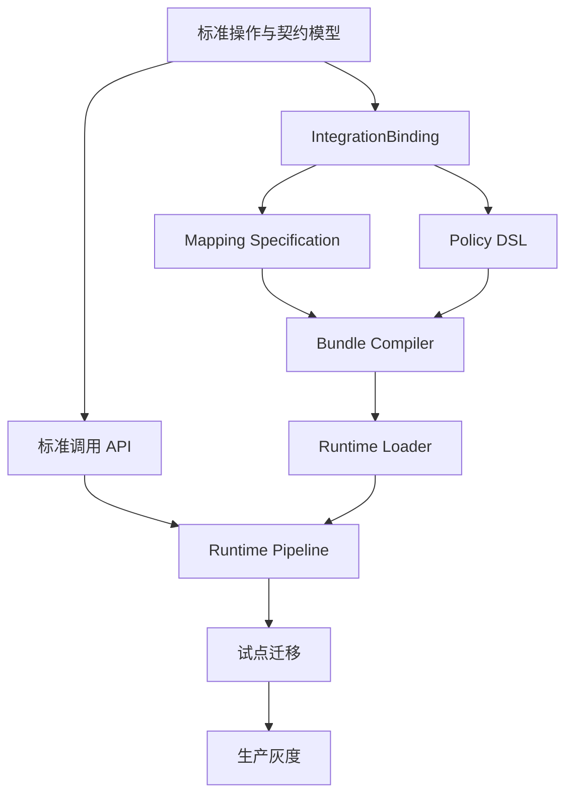

# 第三方集成平台落地实施计划

> Third-Party Integration Platform Implementation Plan

## 1. 文档信息

| 项目 | 内容 |
|---|---|
| 文档名称 | 第三方集成平台落地实施计划 |
| 当前版本 | 0.1.0 |
| 状态 | `DRAFT_EXECUTION_BASELINE` |
| 创建日期 | 2026-08-08 |
| 上位标准 | EESIS《企业外部系统集成标准》0.1.0 |
| 架构依据 | 《第三方集成平台重设计方案》0.2.0 |
| 推荐周期 | 24 周形成生产级试点，9 周形成首个纵向闭环 |

### 1.1 计划定位

本计划将目标架构转化为可执行的建设阶段、工作包、里程碑、人员职责、验收门槛和迁移步骤。

计划以“建设新平台旁路能力并渐进迁移”为基本策略，不直接在旧原型中持续叠加功能，也不采用一次性替换所有现有接口的大爆炸迁移方式。

### 1.2 前提假设

推荐基准团队为 7～9 人：

- 架构师/技术负责人 1 人；
- Java 后端 4 人，其中运行时 2 人、控制面与发布 2 人；
- 前端 1 人；
- 测试/质量工程师 1 人；
- SRE/安全工程师 1 人，可部分投入；
- 产品或业务分析角色 1 人，可由架构师或集成负责人兼任。

如果核心研发只有 3～4 人，建议保持阶段内容不变，将生产级试点周期调整为 32～36 周，不应通过删除安全、发布和测试门禁来压缩时间。

---

## 2. 实施目标

### 2.1 24周目标

在 24 周内完成：

1. 建立标准业务操作、标准契约和第三方契约的管理能力。
2. 建立 Provider、Endpoint、IntegrationBinding 核心模型。
3. 完成请求、响应和回调方向的映射引擎。
4. 完成 Policy DSL Schema、编译器、注册表和首批内置策略。
5. 完成配置工作区、测试、审批、Bundle 编译、发布和回滚闭环。
6. 建立高可用同步运行时、基础回调和异步 Worker。
7. 完成 Secret 引用、标准错误、日志、指标、链路和审计。
8. 迁移至少四类代表性接口并完成生产试点。
9. 建立旧 Groovy 脚本的迁移方法和首批替代证据。
10. 形成后续规模化迁移的模板、测试套件和团队工作方式。

### 2.2 首个纵向闭环

第 9 周必须交付一个可运行的纵向闭环：

```text
标准操作
-> 标准契约
-> Provider / Endpoint
-> IntegrationBinding
-> 请求与响应映射
-> 基础 Policy DSL
-> Bundle 编译与发布
-> Runtime 调用第三方 Mock/测试接口
-> 标准响应
-> 日志、指标和版本追踪
```

纵向闭环不是 Demo 页面，而是后续能力可以持续扩展的真实架构骨架。

### 2.3 不作为首期目标

- 覆盖所有第三方接口；
- 完整 BPMN 或业务流程编排；
- 任意脚本执行平台；
- 一开始就拆分大量微服务；
- 建设覆盖所有业务域的超级标准模型；
- 完整成本结算和供应商采购管理；
- 一开始就实现复杂 AI 自动配置。

---

## 3. 总体实施路线


### 3.1 里程碑

| 里程碑 | 时间 | 结果 |
|---|---:|---|
| M0 项目基线批准 | W2 | 团队、范围、试点、标准和风险基线确定 |
| M1 核心模型冻结 | W5 | 领域模型、API、Bundle、DSL v0.1 和数据库基线确定 |
| M2 首个纵向闭环 | W9 | 一个普通 JSON HTTP 接口端到端运行 |
| M3 P0功能完成 | W13 | 配置、映射、Policy DSL、发布和回滚闭环 |
| M4 复杂场景验证 | W17 | 签名加密、回调、SDK 等代表场景通过 |
| M5 生产就绪评审 | W20 | 性能、安全、高可用和运维演练通过 |
| M6 生产试点验收 | W24 | 灰度上线稳定，旧链路可按计划退役 |

### 3.2 阶段门禁

每个阶段必须满足退出条件才能进入下一阶段。时间到达但门禁未通过时，应调整范围、资源或计划，不得把未解决风险默认转移到生产阶段。

---

## 4. 并行工作流

项目分为七条持续工作流：

| 工作流 | 主要责任 | 核心产物 |
|---|---|---|
| WS1 标准与领域 | 架构师、业务分析 | 标准操作、契约、领域模型、ADR |
| WS2 控制面与发布 | 后端、前端 | 工作区、评审、Bundle、发布、回滚 |
| WS3 运行时 | 后端 | 执行管线、HTTP、缓存、回调、异步 |
| WS4 映射与Policy DSL | 后端、架构师 | Mapping Compiler、Policy Compiler、策略注册表 |
| WS5 安全与可观测 | 安全、SRE、后端 | Secret、权限、日志、指标、链路、审计 |
| WS6 测试与质量 | QA、后端 | 测试套件、Mock、性能、安全和回归证据 |
| WS7 迁移与试点 | 集成负责人、业务团队 | 资产清单、迁移台账、双跑、灰度和退役 |

### 4.1 依赖关系



Bundle 模型、Mapping IR 和 Policy IR 是控制面与运行面的关键边界，必须在早期由双方共同设计，不能分别实现后再拼接。

---

## 5. 阶段0：启动与基线（W1-W2）

### 5.1 目标

建立项目治理、范围、试点和风险基线，防止研发开始后持续改变核心概念。

### 5.2 工作内容

#### 标准和决策

- 评审 EESIS 和平台重设计方案；
- 确认 `operationCode` 编码规则；
- 确认契约版本和兼容性规则；
- 确认配置生命周期和职责分离；
- 确认 Policy DSL 不是通用脚本；
- 建立 ADR 模板和架构变更流程。

#### 资产盘点

从现有代码和数据库形成：

- 第三方清单；
- 活动接口清单；
- 调用方清单；
- 协议和认证类型分布；
- Groovy 脚本清单及依赖；
- 回调清单；
- SDK 接口清单；
- 明文 Secret 和高风险配置清单；
- 现有调用量、成功率和延迟基线。

#### 试点选择

确定四类候选接口：

1. 简单 JSON HTTP 接口；
2. 包含签名或加密的接口；
3. 包含回调或数组映射的接口；
4. 必须使用 SDK 或专有协议的接口。

第一个纵向闭环只选择第1类，其他类型在阶段4进入。

#### 工程准备

- 建立新代码仓库或新顶级工程；
- 建立分支保护、代码审查和提交规范；
- 建立 CI 基线；
- 建立开发、测试环境；
- 建立本地开发依赖和容器化环境；
- 创建初始项目看板和风险台账。

### 5.3 交付物

- 项目章程和范围基线；
- 资产盘点表；
- 试点接口选择记录；
- 风险清单；
- 架构 ADR 基线；
- 代码仓库和 CI 空骨架；
- 24周迭代排期。

### 5.4 退出条件 G0

- 核心团队和负责人已确定；
- 四类试点有明确业务和技术责任人；
- 高风险明文 Secret 已有轮换计划；
- 标准、架构和实施范围已通过评审；
- 明确不在旧原型继续新增无治理脚本。

---

## 6. 阶段1：领域模型与工程基础（W3-W5）

### 6.1 目标

建立不会频繁推倒重来的领域骨架、数据库基线、API 契约和编译制品模型。

### 6.2 核心设计工作

#### 领域模型

完成以下聚合的详细设计：

```text
CanonicalOperation
CanonicalContract
Provider
ProviderContract
ProviderEndpoint
IntegrationBinding
MappingSpecification
PolicyDefinition
ConfigurationWorkspace
DeploymentBundle
Deployment
```

#### 标识和版本

确定：

- 自然编码和数据库 ID 的边界；
- 语义版本规则；
- 草稿版本与发布版本关系；
- 已发布资产不可变约束；
- Bundle ID、checksum 和运行时兼容版本；
- 环境 Overlay 的允许字段。

#### Bundle边界

先定义 Bundle Manifest，再实现各管理页面。Manifest 至少包含：

- 标准操作和契约快照；
- 第三方契约和 Endpoint 快照；
- Mapping IR；
- Policy IR；
- 错误映射；
- Secret 引用；
- 插件依赖；
- 版本、checksum 和发布时间。

### 6.3 工程骨架

建议建立 Maven 多模块：

```text
tpip-shared-kernel
tpip-contract-core
tpip-catalog-domain
tpip-provider-domain
tpip-integration-domain
tpip-release-domain
tpip-runtime-core
tpip-mapping-engine
tpip-policy-spi
tpip-plugin-spi
tpip-transport-http
tpip-persistence-mysql
tpip-control-plane-app
tpip-runtime-app
tpip-test-kit
```

首期技术基线建议：

- Java LTS；
- Spring Boot 3 系列组织批准版本；
- Maven 多模块；
- MySQL 8；
- Flyway 或组织批准的数据库迁移工具；
- Jackson Tree Model；
- JSON Schema 校验器；
- JSONPath Profile 1.0 参考实现；
- 受限条件表达式引擎；
- Micrometer/OpenTelemetry 兼容可观测体系；
- 企业 Secret Manager 或 KMS 适配接口。

具体库的版本应在技术 Spike 后锁定并进入依赖治理，不在架构文档中写死。

### 6.4 数据库基线

第一批迁移脚本只创建核心表：

```text
catalog_canonical_operation
catalog_contract_definition
catalog_contract_version
provider_provider
provider_contract
provider_endpoint
integration_binding
integration_mapping_definition
integration_mapping_rule
integration_policy_definition
release_configuration_workspace
release_workspace_asset
release_deployment_bundle
release_deployment_record
governance_audit_event
```

所有表从第一版开始具备：

- 唯一约束；
- 版本字段；
- 乐观锁；
- 创建和修改主体；
- 生命周期状态；
- 必要外键或等价完整性约束。

### 6.5 质量基线

- 单元测试框架；
- 架构依赖测试，禁止领域层依赖适配器层；
- API 契约测试；
- 数据库迁移测试；
- 代码质量和依赖安全扫描；
- Secret 扫描；
- 统一异常和日志脱敏基线。

### 6.6 退出条件 G1

- 核心领域模型评审通过；
- Bundle Manifest v0.1 冻结；
- Mapping IR 和 Policy IR v0.1 冻结；
- 数据库迁移可在空库重复执行；
- 控制面和运行时能够共同读取同一个 Bundle 测试样例；
- 工程骨架通过 CI。

---

## 7. 阶段2：首个纵向闭环（W6-W9）

### 7.1 目标

用一个普通 JSON HTTP 接口打通从配置到运行的完整链路，验证架构边界，而不是追求功能数量。

### 7.2 控制面最小能力

首期可以 API 优先，UI 只提供必要表单：

- 创建标准操作和 JSON Schema 契约；
- 创建 Provider、ProviderContract 和 Endpoint；
- 创建 IntegrationBinding；
- 配置请求和响应映射；
- 配置 Header 注入、超时和成功判定；
- 创建测试用例；
- 编译和发布 Bundle；
- 查看 Bundle 内容、版本和 Diff。

### 7.3 映射引擎 v0.1

支持：

- 对象字段一对一映射；
- JSONPath 源选择；
- 目标路径自动构建；
- STRING、NUMBER、BOOLEAN 和 DATE；
- required、default、onMissing 和 onError；
- 枚举转换；
- 发布时选择器编译；
- 规则级诊断。

暂不支持复杂数组聚合、跨数组关联和任意表达式。

### 7.4 Policy DSL v0.1

支持：

- DSL Schema；
- 固定阶段；
- 策略注册表；
- Header/Query/Body 元数据注入；
- API Key Secret 引用；
- 总超时、连接超时和读取超时；
- HTTP 状态与第三方业务码成功判定；
- Policy IR 编译；
- 未注册策略和非法阶段拒绝。

### 7.5 Runtime v0.1

支持：

- `operationCode` 标准调用 API；
- Bundle 下载、checksum 校验和本地缓存；
- 标准请求 Schema 校验；
- 请求映射；
- Policy 执行；
- HTTP/HTTPS 调用；
- 响应映射；
- 标准响应 Schema 校验；
- 标准错误；
- traceId、requestId、operationCode、bundleVersion 指标和日志。

### 7.6 发布 v0.1

暂采用简化状态：

```text
DRAFT -> VERIFIED -> APPROVED -> READY -> ACTIVE
```

必须保留：

- 已发布版本不可变；
- Bundle checksum；
- 发布审计；
- 运行时预热；
- 上一版本回滚。

### 7.7 演示场景

演示必须从空工作区开始，由配置人员完成：

1. 创建或选择标准操作；
2. 导入标准和第三方样例；
3. 配置字段映射；
4. 配置 Header、超时和成功码策略；
5. 运行测试；
6. 审批并发布；
7. 业务系统按 `operationCode` 调用；
8. 查看转换结果、版本和链路；
9. 发布一个错误版本并证明门禁阻止；
10. 发布新版本后演示回滚。

### 7.8 退出条件 G2

- 一个真实或高度等价的测试接口端到端通过；
- 新增该接口未修改运行时代码；
- 控制面停机后运行时仍能使用已缓存 Bundle；
- 能定位到映射规则或 Policy Step 的失败；
- Bundle 可以发布、切换和回滚；
- 没有明文 Secret 进入数据库、Bundle 和日志。

---

## 8. 阶段3：P0能力完善（W10-W13）

### 8.1 目标

将首个纵向闭环扩展为可支撑多接口配置的 P0 平台内核。

### 8.2 映射能力完善

- 嵌套对象；
- 数组父子规则和逐项映射；
- 常量、上下文和条件字段；
- 日期格式、枚举、字典和精度转换；
- Mapping Plan 静态优化；
- 必填字段覆盖率；
- Schema 与映射类型冲突检查；
- 新旧映射版本 Diff；
- 映射性能和资源限制。

### 8.3 Policy DSL完善

- 受限条件表达式；
- OAuth2 Client Credentials；
- HMAC/RSA及组织批准的国密策略接口；
- AES/SM4等组织批准的加解密策略接口；
- Retry、Circuit Breaker、Rate Limit；
- 幂等与危险重试静态检查；
- Secret 环境和数据区域校验；
- 策略链可视化预览；
- CompiledPolicyPlan 诊断信息。

算法实现必须使用经过组织批准的密码库，不自行实现密码算法。

### 8.4 配置流程完善

- ConfigurationWorkspace；
- 资产依赖闭包；
- 完整状态机；
- 乐观锁和并发冲突；
- 语义 Diff；
- 基于风险的审批；
- 环境 Overlay；
- DEV、TEST、UAT 晋级；
- 发布候选和证据归档。

### 8.5 错误与可观测性

- 标准错误分类；
- Provider 错误码映射；
- 映射、策略、网络和业务失败归因；
- operation/provider/bundle 维度指标；
- 慢调用和错误采样；
- 敏感字段自动脱敏；
- 发布前后指标对比。

### 8.6 退出条件 G3

- P0 功能清单全部完成；
- 至少 30 个自动化映射用例；
- 至少 20 个 Policy DSL 正反向校验用例；
- 危险重试、越权 Secret、非法阶段和未注册策略会被编译器拒绝；
- 配置从工作区到 UAT 完成全流程；
- 映射和策略性能达到初步预算；
- 无阻断级安全问题。

---

## 9. 阶段4：复杂场景试点（W14-W17）

### 9.1 目标

验证设计不是只适用于最简单 HTTP 接口，并完成 Groovy 迁移路径验证。

### 9.2 试点A：签名或加密接口

验证：

- 时间戳和上下文注入；
- 参数规范化；
- Secret 引用；
- 签名和验签；
- 请求加密和响应解密；
- 固定测试向量；
- 安全失败不可忽略。

### 9.3 试点B：数组或回调接口

验证：

- 数组逐项映射；
- 回调 Route Key；
- 回调验签；
- 幂等和重复回调；
- 标准事件转换；
- 回调应答映射；
- 失败重投或死信处理。

### 9.4 试点C：SDK或专有能力

验证：

- Plugin SPI；
- 插件描述符和配置 Schema；
- 插件版本与 Runtime 兼容性；
- 资源和权限限制；
- 插件测试证据；
- SDK仍遵循标准契约、Bundle和审计体系。

### 9.5 Groovy迁移试点

选择至少三个旧脚本：

1. 字段拼装脚本，迁移到 Mapping；
2. 签名或加密脚本，迁移到 Policy DSL；
3. 特殊算法脚本，判断进入 Converter、Policy Plugin 或业务重构。

每个脚本完成：

```text
发现
-> 依赖分析
-> 能力分类
-> 目标配置或插件设计
-> 等价测试
-> 影子运行
-> 灰度
-> 退役
```

### 9.6 退出条件 G4

- 三类复杂试点全部通过 UAT；
- 至少一个 Groovy 脚本完全退出生产调用链；
- 至少一个 SDK 通过统一 Plugin 模型接入；
- 回调幂等和重复投递测试通过；
- 安全评审没有高危未处理项；
- 配置人员无需改运行时代码即可完成新绑定。

---

## 10. 阶段5：生产就绪（W18-W20）

### 10.1 目标

证明平台可以安全、稳定、可运维地承载生产流量。

### 10.2 性能与容量

执行：

- 单实例基准测试；
- 映射规则数量阶梯测试；
- Policy Step 数量阶梯测试；
- 小报文、大报文和大数组测试；
- 并发连接池测试；
- Bundle 大规模预热测试；
- 回调峰值测试；
- 第三方慢响应和连接失败测试。

形成容量模型：

```text
实例数 = 峰值TPS × 单请求平均资源 / 单实例安全容量 × 冗余系数
```

不得只按平均流量评估容量。

### 10.3 高可用与故障演练

- Runtime 实例宕机；
- Control Plane 停机；
- 数据库只读或短时不可用；
- Bundle 仓库不可用；
- Secret Manager 短时不可用；
- 第三方超时和错误激增；
- 配置错误发布；
- 插件加载失败；
- 网络分区；
- 回滚演练。

验证控制面故障不影响已加载 Bundle 的运行时调用。

### 10.4 安全

- 身份认证和调用方授权；
- 设计、审批和发布职责分离；
- Secret 最小权限；
- 配置越权测试；
- DSL 表达式逃逸测试；
- 插件权限和供应链扫描；
- 日志敏感数据检查；
- API 限流和报文大小限制；
- 审计完整性检查。

### 10.5 运维准备

- Dashboard；
- 告警规则；
- 值班手册；
- 常见错误排查手册；
- 发布和回滚手册；
- Secret 轮换手册；
- 第三方故障处置流程；
- 容量扩展流程；
- 数据备份和恢复演练。

### 10.6 退出条件 G5

- 性能达到批准的容量和延迟目标；
- 高可用演练通过；
- 生产回滚演练通过；
- 安全高危问题为零；
- 监控、告警、值班和应急手册齐备；
- 生产变更评审批准。

---

## 11. 阶段6：生产灰度与验收（W21-W24）

### 11.1 上线顺序

推荐按风险递增上线：

1. 只读、低风险、可人工核对接口；
2. 普通同步查询接口；
3. 带签名或加密的查询接口；
4. 回调接口；
5. SDK或专有协议接口；
6. 非幂等写接口最后迁移。

### 11.2 灰度步骤

```text
0%：生产环境预热与探测
1%-5%：内部或指定调用方
10%-25%：低风险租户/业务
50%：新旧结果与指标对比
100%：完整切换
观察期：保持旧链路可快速恢复
退役：达到观察期且无阻断问题
```

每次扩大流量必须检查：

- 成功率和错误结构；
- P95/P99 延迟；
- 新旧结果差异；
- 重试和幂等记录；
- 第三方限流和配额；
- 映射和Policy失败；
- 敏感日志告警。

### 11.3 回滚触发条件

出现以下任一情况应停止扩大流量并评估回滚：

- 标准结果语义错误；
- 重复提交或幂等失效；
- 签名、验签或加解密异常显著增加；
- 新版本成功率低于既定阈值；
- P99 延迟超过预算；
- 敏感信息泄露；
- 无法追溯实际 Bundle 版本；
- 告警或审计链路失效。

### 11.4 最终验收 G6

- 代表性接口生产稳定运行至少两个完整业务周期；
- 所有调用能够追溯到确定 Bundle；
- 新旧链路结果差异处于批准范围；
- 回滚能力经过生产或等价演练；
- 旧链路有明确退役日期；
- 运维、平台和业务团队完成交接；
- 形成规模化迁移复盘和新版计划。

---

## 12. 试点选择方法

### 12.1 评分维度

为候选接口按 1～5 分评分：

| 维度 | 低分 | 高分 |
|---|---|---|
| 业务风险 | 只读、非关键 | 资金、订单、不可逆 |
| 技术复杂度 | 普通JSON HTTP | SDK、文件、加密、回调 |
| 调用量 | 低 | 高 |
| 可测试性 | 有稳定测试环境 | 无测试环境、结果不确定 |
| 可回滚性 | 可快速切回 | 无法并行或回滚 |
| 代表性 | 特例 | 可代表大量接口 |
| 业务配合度 | 无责任人 | 有明确团队配合 |

首个接口应选择：业务风险低、技术复杂度低、可测试性和代表性高。不能为了展示平台能力，第一步就选择最复杂或最关键的接口。

### 12.2 四类试点验收矩阵

| 试点 | 主要验证 | 推荐阶段 |
|---|---|---|
| 普通 JSON HTTP | 标准契约、映射、Bundle、Runtime | W6-W9 |
| 签名/加密接口 | Policy DSL、Secret、安全向量 | W14-W15 |
| 数组/回调接口 | 数组映射、验签、幂等、事件 | W15-W16 |
| SDK接口 | Plugin SPI、资源和版本隔离 | W16-W17 |

---

## 13. 产品与研发工作包

### EPIC-01 标准契约目录

交付：

- 业务域、能力、操作管理；
- JSON Schema 契约；
- 契约版本和兼容性；
- 字段语义和敏感等级；
- 示例和 Diff。

### EPIC-02 连接方与端点

交付：

- Provider；
- ProviderContract；
- Endpoint；
- 环境 Overlay；
- SecretReference；
- 网络和证书探测。

### EPIC-03 IntegrationBinding

交付：

- 标准操作与第三方接口绑定；
- 请求、响应、回调引用；
- 幂等和合规属性；
- 绑定版本和责任人。

### EPIC-04 Mapping Engine

交付：

- Selector Profile；
- Target Writer；
- Converter Registry；
- 对象和数组映射；
- Mapping Compiler/IR；
- 诊断和测试工具。

### EPIC-05 Policy DSL

交付：

- DSL Schema；
- Policy Registry；
- 条件表达式 Profile；
- Policy Compiler/IR；
- 内置认证、签名、加密、结果和治理策略；
- 安全及幂等静态检查。

### EPIC-06 Bundle与发布

交付：

- ConfigurationWorkspace；
- 验证、评审、审批；
- Bundle Compiler；
- 制品仓库；
- 环境晋级；
- Runtime 预热；
- 灰度和回滚。

### EPIC-07 Runtime

交付：

- 标准调用API；
- 执行管线；
- HTTP Transport；
- Bundle L1缓存；
- 标准错误；
- 回调和异步作业；
- 插件执行。

### EPIC-08 安全与可观测

交付：

- 调用方身份与权限；
- Secret Manager适配；
- 审计；
- 日志脱敏；
- 指标和链路；
- Dashboard和告警。

### EPIC-09 测试中心

交付：

- 样例预览；
- Mock Provider；
- 映射和Policy单测；
- 契约测试；
- 回归测试；
- 发布证据。

### EPIC-10 迁移工具

交付：

- 旧表数据提取；
- 资产清洗报告；
- Groovy脚本迁移台账；
- 旧API兼容适配器；
- 新旧结果比对工具。

---

## 14. 团队与职责

### 14.1 推荐分工

| 角色 | 主要职责 |
|---|---|
| 架构师/技术负责人 | 标准、领域边界、IR/Bundle、ADR、跨组决策 |
| Runtime负责人 | 执行管线、HTTP、缓存、性能、高可用 |
| Control Plane负责人 | 工作区、版本、审批、Bundle和发布 |
| Mapping/DSL负责人 | 编译器、注册表、静态检查和运行接口 |
| 前端工程师 | 契约、映射、策略、发布和运行工作台 |
| QA | 测试策略、Mock、回归、性能和发布证据 |
| SRE | 环境、可观测、容量、发布和应急演练 |
| 安全负责人 | Secret、密码算法、插件、权限和安全评审 |
| 业务接口负责人 | 标准语义、样例、验收和生产灰度 |

### 14.2 决策责任

| 决策 | 最终责任人 |
|---|---|
| 标准业务语义 | 业务域负责人 |
| 标准契约兼容性 | 架构师 + 业务域负责人 |
| Runtime和Bundle技术边界 | 技术负责人 |
| 密码算法和Secret | 安全负责人 |
| 生产发布 | 发布负责人/变更审批人 |
| 试点业务验收 | 对应业务系统负责人 |

---

## 15. 迭代和交付节奏

### 15.1 迭代节奏

采用两周一个迭代：

```text
迭代开始：目标和验收样例确定
日常：短同步 + 风险暴露
中期：架构/接口联调
迭代结束：可运行演示 + 自动化证据 + 复盘
```

每个迭代必须交付可执行结果，不接受仅完成数据库表或接口空壳而无法纵向验证。

### 15.2 Definition of Ready

一个需求进入研发前必须具备：

- 明确业务语义；
- 输入输出样例；
- 验收条件；
- 数据敏感等级；
- 依赖和影响范围；
- 错误和边界场景；
- 责任人。

### 15.3 Definition of Done

一个平台能力完成必须具备：

- 代码评审通过；
- 单元和集成测试通过；
- API或Schema已版本化；
- 数据库迁移可回放；
- 日志无敏感信息；
- 指标和错误码完成；
- 安全检查通过；
- 文档和样例完成；
- 回滚或兼容策略明确；
- CI证据可追溯。

---

## 16. 测试计划

### 16.1 测试金字塔

```text
单元测试
├── Domain规则
├── Mapping规则
├── Converter
├── Policy Compiler
└── Bundle Compiler

组件测试
├── Mapping Engine
├── Policy Runtime
├── HTTP Transport
├── Secret Adapter
└── Runtime Loader

契约测试
├── 标准调用API
├── Provider Mock
└── Bundle兼容性

端到端测试
├── 配置到发布
├── 同步调用
├── 回调
└── 回滚
```

### 16.2 必测边界

- 来源字段缺失、空值和类型错误；
- 数组为空、超长和子项失败；
- 非法JSONPath和目标路径；
- 未注册策略和非法阶段；
- Secret不可访问和跨环境引用；
- 签名验签不一致；
- 非幂等危险重试；
- 第三方慢响应、断开和异常状态码；
- Bundle损坏和版本不兼容；
- 控制面不可用；
- 插件加载失败；
- 日志脱敏和审计完整性。

### 16.3 回归基线

每个已发布 Binding 必须绑定最小回归套件。任何影响契约、映射、Policy、Endpoint或插件的变更，都根据依赖关系自动选择并执行受影响测试。

---

## 17. 数据与Groovy迁移计划

### 17.1 迁移原则

- 旧库只作为来源，不作为新运行时持续依赖；
- 不将EAV配置原样复制到新表；
- 先建立标准语义，再迁移第三方配置；
- Secret先轮换后迁移引用；
- 脚本按能力拆分，不逐行机械翻译；
- 每批迁移都可双跑和回滚。

### 17.2 数据迁移步骤

```text
抽取
-> 规范化
-> 去重和补全关系
-> 分类Endpoint/Mapping/Policy/Secret
-> 生成迁移候选
-> 人工确认语义
-> 导入配置工作区
-> 自动验证
-> 发布到测试环境
```

### 17.3 迁移波次

| 波次 | 内容 | 目标 |
|---|---|---|
| Wave 0 | 资产和风险清单 | 知道有什么、谁在用、风险多大 |
| Wave 1 | 4类试点接口 | 验证架构和迁移工具 |
| Wave 2 | 10～20个高复用HTTP接口 | 验证规模化配置效率 |
| Wave 3 | 含回调、加密和脚本接口 | 扩展策略覆盖 |
| Wave 4 | 低频特例和遗留接口 | 插件、重构或退役决策 |

### 17.4 Groovy迁移指标

每个脚本记录：

- 脚本编码和当前调用量；
- Spring Bean、数据库、网络和文件依赖；
- 安全风险等级；
- 目标类型：Mapping/Converter/Policy/Plugin/业务重构；
- 等价测试覆盖；
- 影子运行差异；
- 切换时间；
- 退役时间和责任人。

---

## 18. 上线与回滚计划

### 18.1 上线前检查

- Bundle不可变且checksum验证通过；
- Runtime所有实例预热成功；
- Secret引用可用；
- 测试和审批证据齐全；
- Dashboard和告警已启用；
- 调用方灰度范围已配置；
- 旧链路保持可用；
- 回滚责任人在线；
- 第三方配额和限流已确认。

### 18.2 回滚单位

回滚单位是 `operationCode + environment + DeploymentBundleVersion`，不是数据库表或某条临时配置。

回滚流程：

```text
触发告警
-> 冻结流量扩大
-> 确认影响操作和Bundle
-> 切换上一已发布Bundle
-> 验证Runtime实例状态
-> 验证业务和第三方指标
-> 记录事件
-> 开展根因分析
```

### 18.3 数据型副作用

对于支付、订单、发货等写操作，技术回滚不能自动撤销已经发生的外部业务动作。必须在试点前定义：

- 幂等键；
- 状态查询能力；
- 对账和补偿方式；
- 人工处置入口；
- 是否允许自动重试和供应商切换。

---

## 19. 度量和成功标准

### 19.1 交付指标

- 里程碑按期率；
- 阶段门禁首次通过率；
- 自动化测试通过率；
- 阻断缺陷数量；
- 架构例外数量和关闭时间。

### 19.2 平台价值指标

建议跟踪：

| 指标 | 首期目标方向 |
|---|---|
| 普通HTTP接口配置化率 | 持续提高 |
| 新增常规接口需修改Runtime代码比例 | 接近0 |
| Groovy活动脚本数量 | 持续下降 |
| 配置从提交到可发布的时间 | 可量化并持续缩短 |
| 发布可追溯率 | 100% |
| Bundle回滚成功率 | 100%演练通过 |
| 敏感配置明文数量 | 0 |
| 调用版本可追溯率 | 100% |
| 映射/Policy自动测试覆盖率 | 持续提高 |
| Provider故障归因准确率 | 可审计 |

首期不要用“接入接口总数量”作为唯一成功指标，否则容易牺牲标准质量换取数量。

---

## 20. 风险与应对

| 风险 | 预警信号 | 应对 |
|---|---|---|
| 标准讨论过久 | 三周仍无首个契约 | 以试点为载体冻结v0.1，后续版本演进 |
| UI投入过早 | 页面很多但无调用闭环 | API/Compiler/Runtime优先，UI跟随闭环 |
| Policy DSL膨胀 | 需求开始要求循环、网络、数据库 | 坚守边界，进入Plugin或业务重构 |
| 控制面与运行时分裂 | 各自定义不同模型 | 共同维护Bundle、Mapping IR、Policy IR |
| 旧数据直接复制 | 新库继续出现EAV和明文Secret | 设置语义清洗和人工确认门禁 |
| 试点过于复杂 | 前9周无法闭环 | 第一个试点选择简单可测试接口 |
| 只做正常路径 | 上线后错误无法归因 | 异常、超时、回滚从首个闭环就纳入 |
| 平台变成单点 | 所有请求依赖在线配置库 | 不可变Bundle、本地缓存、多实例 |
| 业务不参与 | 标准契约无人确认 | 每个操作必须有业务责任人签字 |
| 迁移长期双轨 | 旧链路不退役 | 每个波次设置退役日期和KPI |

---

## 21. 前两周直接执行清单

### 第1周

#### Day 1

- 明确项目负责人、架构负责人和四类试点责任人；
- 建立项目看板、风险台账和ADR目录；
- 冻结“旧系统不新增无治理脚本”原则。

#### Day 2

- 导出现有第三方、服务、配置、脚本、回调和调用方清单；
- 标记明文Secret和Spring/数据库脚本依赖；
- 建立调用量和关键性字段。

#### Day 3

- 按简单HTTP、签名加密、回调数组、SDK四类给接口分类；
- 选择首个简单HTTP试点；
- 确认该试点业务语义和责任人。

#### Day 4

- 为首个试点定义 `operationCode`；
- 建立标准请求、响应和错误JSON Schema草案；
- 建立第三方请求和响应Schema草案。

#### Day 5

- 评审标准契约；
- 明确输入输出样例、错误样例和敏感字段；
- 确认新旧结果比对方法。

### 第2周

#### Day 6

- 建立新Maven多模块仓库；
- 配置Java、依赖治理、格式、测试和CI；
- 创建架构依赖测试。

#### Day 7

- 设计CanonicalOperation、Provider、Contract、Endpoint和Binding；
- 决定自然编码、版本和生命周期；
- 输出初版ER模型。

#### Day 8

- 定义Bundle Manifest v0.1；
- 定义Mapping IR v0.1；
- 定义Policy IR v0.1。

#### Day 9

- 定义标准调用API；
- 定义标准错误模型；
- 定义运行时InvocationContext和执行阶段。

#### Day 10

- 开展M0评审；
- 固化W3-W5任务；
- 确认技术Spike清单；
- 对未决问题指定责任人和截止时间。

### 两周后必须能看到的结果

- 一个确定的简单HTTP试点；
- 一组经过业务确认的标准契约；
- 一份清洗后的旧资产和Groovy清单；
- 一个可编译的工程骨架；
- Bundle、Mapping IR、Policy IR初稿；
- 明确的W3-W9纵向闭环任务。

---

## 22. 项目启动检查表

### 组织

- [ ] 项目负责人已确定
- [ ] 架构、运行时、控制面、测试和SRE责任人已确定
- [ ] 业务域负责人已参与
- [ ] 安全评审资源已预约

### 范围

- [ ] P0/P1/P2边界明确
- [ ] 首个简单HTTP试点已确定
- [ ] 三类复杂试点候选已确定
- [ ] 旧系统继续开发的边界已明确

### 工程

- [ ] 新代码仓库已建立
- [ ] CI和分支保护已建立
- [ ] 开发和测试环境已准备
- [ ] 数据库迁移机制已选定
- [ ] Secret方案已有可用环境

### 标准

- [ ] operationCode规则已确认
- [ ] 契约版本规则已确认
- [ ] Bundle不可变原则已确认
- [ ] Policy DSL安全边界已确认
- [ ] 发布和回滚职责已确认

---

## 23. 结论

落地的关键不是先建设完整管理后台，而是先在9周内形成一个真实的纵向闭环，并从第一天就把标准契约、Policy DSL编译、不可变Bundle、Secret引用、发布审计和回滚纳入主路径。

推荐用24周完成生产级试点：前5周冻结核心模型和工程边界，W6-W9打通普通HTTP接口，W10-W13完成P0能力，W14-W17验证签名加密、回调和SDK，W18-W20完成生产就绪，W21-W24灰度上线并形成规模化迁移模板。

平台建设和旧系统迁移应并行推进，但新运行时不得依赖旧配置库作为长期运行来源。最终衡量标准不是写了多少代码或配置了多少页面，而是业务是否真正只依赖标准操作、配置是否可验证和可回滚、Groovy是否持续退出生产链路，以及每次调用是否能够追溯到确定的标准契约和DeploymentBundle。

