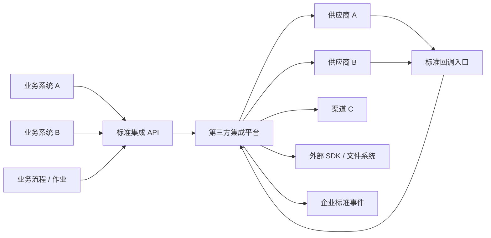
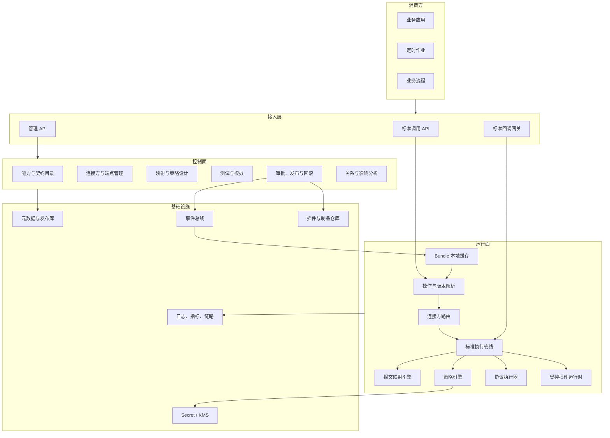
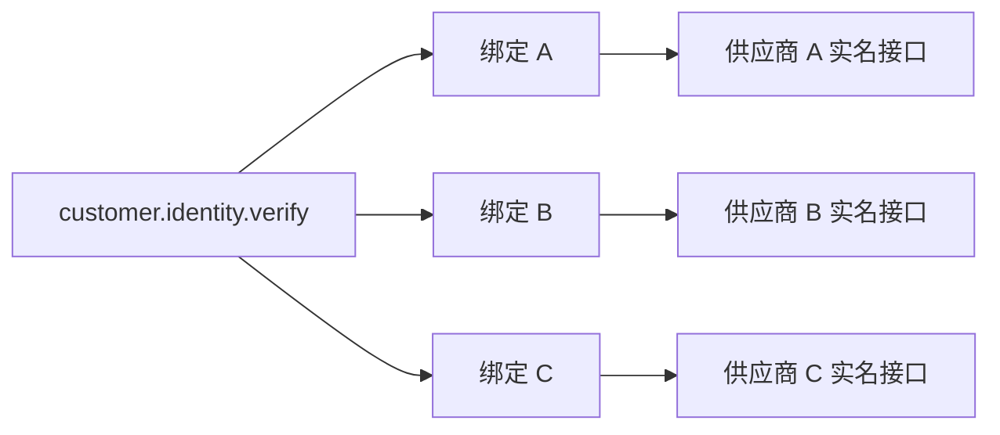
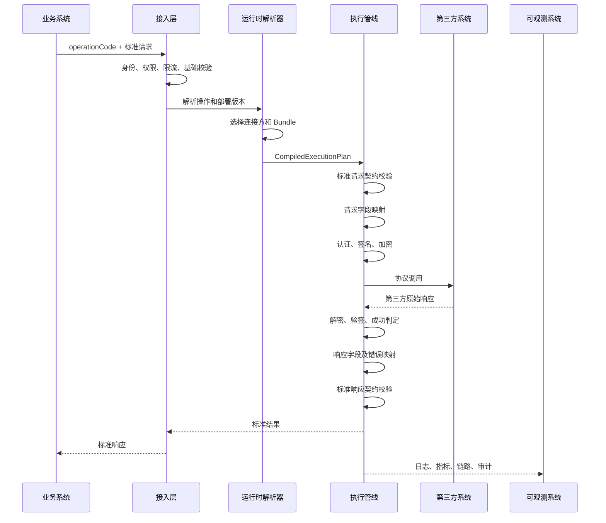
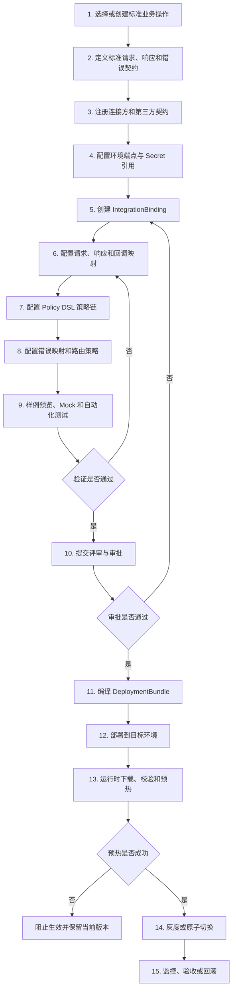
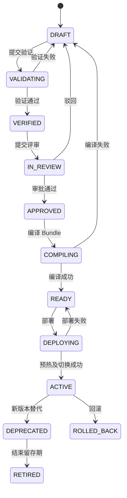
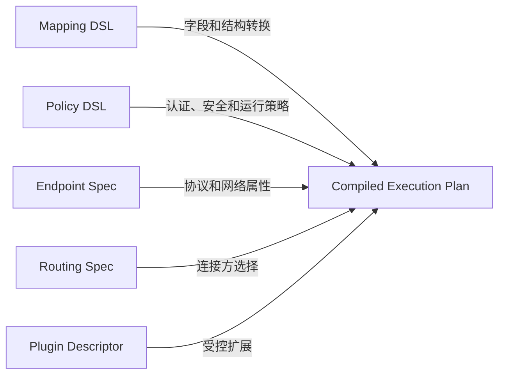
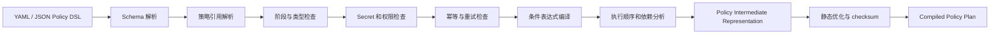
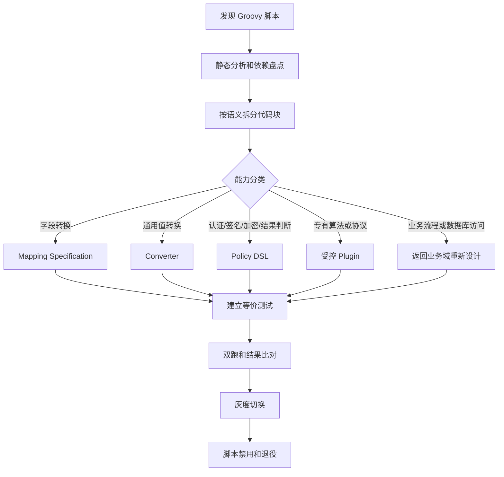
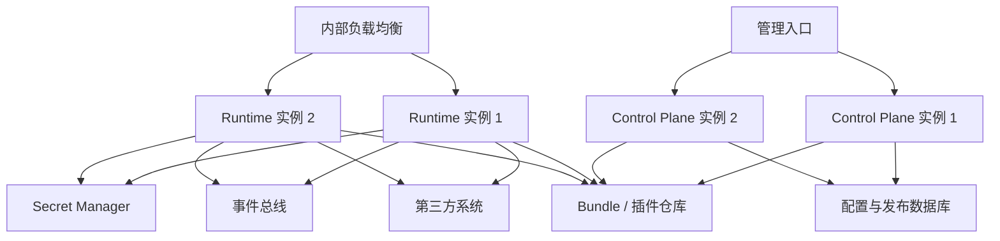

# 第三方集成平台重设计方案

> Third-Party Integration Platform Redesign（TPIP）

## 1. 文档信息

| 项目 | 内容 |
|---|---|
| 文档名称 | 第三方集成平台重设计方案 |
| 文档代号 | TPIP Architecture |
| 当前版本 | 0.2.0 |
| 状态 | `DRAFT_ARCHITECTURE_BASELINE` |
| 创建日期 | 2026-08-08 |
| 上位标准 | EESIS《企业外部系统集成标准》0.1.0 |
| 参考对象 | 现有 `3part_access_system` 架构验证原型 |

### 1.1 文档定位

本文在 EESIS 企业标准约束下，重新设计第三方集成平台的目标架构、领域边界、运行模型、控制模型、数据模型、部署模型和迁移路线。

它不是对现有原型进行局部修补，也不要求所有项目复制某个固定工程结构。平台是 EESIS 的首个参考实现和公共运行载体，业务项目可以选择远程调用平台或嵌入符合标准的运行时组件。

### 1.2 核心结论

新系统不再以“数据库中的第三方服务记录”为中心，而以“企业标准业务操作”为入口，以“集成绑定”为适配关系，以“不可变部署制品”为运行依据。

核心模型为：

```text
标准业务能力
  -> 标准业务操作及契约
  -> 连接方及第三方契约
  -> 集成绑定
  -> 不可变部署制品
  -> 标准集成运行时
```

---

## 2. 现有原型的继承与重构判断

### 2.1 应当保留的思想

1. 绝大多数第三方 SDK 本质上仍是对 HTTP 协议、认证和报文处理的封装。
2. 高频变化的地址、参数、认证和报文差异应由数据和配置管理。
3. 新增常规第三方接口不应要求业务系统重新打包发布。
4. 少数无法声明式表达的能力应通过插件扩展。
5. 第三方、服务、环境和配置需要统一管理。

### 2.2 需要重构的部分

| 现有思路 | 主要问题 | 新设计 |
|---|---|---|
| 以 `RelatedService` 为核心 | 业务语义和供应商接口混合 | 标准操作与第三方契约分离 |
| 通用接口直接按服务标识调用 | 业务系统感知供应商和实现细节 | 按 `operationCode` 调用标准契约 |
| EAV 参数配置 | 类型、约束、版本和依赖难治理 | 结构化规范 + 环境覆盖层 |
| 活动配置直接被运行时查询 | 半发布、版本漂移和性能风险 | 编译为不可变部署制品 |
| Groovy 承担大量差异 | 安全边界弱、难测试和审计 | 标准策略 + 受控转换器 + 插件 |
| SDK 与通用 HTTP 分成两套应用 | 能力重复、调用模型分裂 | 统一运行时 + 协议/插件适配器 |
| 业务代码硬编码 JSONPath | 重复、无法治理 | 版本化双向映射规范 |
| 凭证进入普通配置 | 泄露和轮换风险 | Secret 引用与独立凭证域 |
| 数据表即发布结果 | 缺少完整快照和证据 | Bundle 编译、审批、发布、回滚 |

### 2.3 不采用的极端方案

- 不把所有供应商能力都写成独立 Java 微服务。
- 不把所有差异都塞进一个万能脚本引擎。
- 不要求业务系统直接理解第三方字段。
- 不在第一阶段拆分十几个独立微服务。
- 不追求一个覆盖所有业务域的超级标准报文。
- 不允许生产运行时在一次调用中组合多个不确定的活动配置版本。

---

## 3. 系统定位和边界

### 3.1 平台定位

第三方集成平台是企业业务系统与外部系统之间的防腐层和运行平台，负责吸收外部协议、字段、认证、策略及供应商差异。



### 3.2 平台负责

- 标准业务契约管理；
- 连接方及第三方契约管理；
- 请求、响应和回调报文转换；
- HTTP、文件及少量 SDK 协议适配；
- 认证、签名、验签、加密和解密；
- 超时、重试、限流、熔断、隔离和幂等；
- 多供应商路由、灰度和故障切换；
- 配置编译、测试、审批、发布和回滚；
- 标准错误、日志、指标、链路和审计；
- 外部回调接收、验签、去重和事件转换。

### 3.3 平台不负责

- 业务规则决策和业务流程编排；
- 企业主数据的最终管理；
- 供应商采购、合同和结算本身；
- 长周期业务状态机；
- 通用 ESB 的所有协议和所有企业系统集成问题；
- 为规避标准而无限制承载项目私有脚本。

---

## 4. 目标逻辑架构



### 4.1 架构取舍

首期采用“逻辑分域、物理适度分离”的模块化架构：

- 控制面独立部署；
- 同步运行面独立部署；
- 回调与异步任务可先作为运行面模块，达到容量或隔离条件后再独立；
- 各领域先使用同一关系数据库中的独立 Schema 或表前缀；
- 领域之间只通过应用服务、端口或领域事件交互，不跨域直接操作数据表。

这种方式比立即微服务化更适合当前阶段：边界清晰，但不会过早承担分布式事务、服务治理和运维复杂度。

---

## 5. 领域边界

### 5.1 能力与契约域 `catalog`

职责：

- 维护业务域、标准业务能力和标准操作；
- 维护标准请求、响应、事件和错误契约；
- 管理字段语义、类型、敏感等级和兼容性；
- 提供契约版本比较和兼容性检查。

核心聚合：

```text
BusinessDomain
CanonicalCapability
CanonicalOperation
CanonicalContract
ContractVersion
```

### 5.2 连接方域 `provider`

职责：

- 维护供应商、渠道和合作伙伴；
- 维护第三方接口契约；
- 维护环境端点、网络参数和 SLA 属性；
- 维护凭证引用，不保存明文凭证；
- 管理供应商状态、能力和环境可用性。

核心聚合：

```text
Provider
ProviderCapability
ProviderContract
ProviderEndpoint
CredentialReference
```

### 5.3 集成设计域 `integration`

职责：

- 将标准操作绑定到一个或多个第三方接口；
- 定义四个方向的报文映射；
- 编排认证、签名、加解密和调用策略；
- 定义业务成功和错误映射；
- 定义多供应商路由及故障切换策略。

核心聚合：

```text
IntegrationBinding
MappingSpecification
MappingRule
PolicyChain
ProviderRoutingPolicy
ErrorMapping
```

### 5.4 测试与验证域 `verification`

职责：

- 保存脱敏或合成测试用例；
- 验证契约、选择器、映射和策略；
- 提供 Mock Provider；
- 执行回归、一致性、性能和安全测试；
- 生成发布证据。

核心聚合：

```text
TestSuite
TestCase
MockExpectation
VerificationRun
VerificationEvidence
```

### 5.5 发布域 `release`

职责：

- 生成不可变部署制品；
- 管理评审、审批、灰度、发布、回滚和退役；
- 计算依赖闭包及内容校验和；
- 发布配置变更事件；
- 提供版本和影响分析。

核心聚合：

```text
ReleaseCandidate
Approval
DeploymentBundle
Deployment
RollbackRecord
```

### 5.6 运行域 `runtime`

职责：

- 接收标准调用和第三方回调；
- 解析操作、租户、环境和部署版本；
- 执行路由、映射、策略、协议调用和校验；
- 产生标准结果及可观测数据；
- 保证配置版本、幂等和资源边界。

核心运行对象：

```text
InvocationContext
ResolvedDeployment
CompiledExecutionPlan
CanonicalRequest
CanonicalResponse
ProviderExchange
InvocationResult
```

### 5.7 安全与治理域 `governance`

职责：

- 权限、职责分离和数据范围控制；
- Secret 引用策略；
- 数据分类、脱敏和留存；
- 管理行为审计；
- EA 与 PCS 资产关系登记。

---

## 6. 核心模型重设计

### 6.1 调用主键从服务 ID 变为标准操作编码

业务系统调用：

```text
operationCode = customer.identity.verify
operationVersion = 1.x
```

业务系统不应调用：

```text
serviceId = 859012
provider = 某供应商
url = https://...
```

`operationCode` 表达业务意图；具体供应商、接口、映射和端点由平台解析。

### 6.2 集成绑定

`IntegrationBinding` 是新系统最关键的聚合，它描述“某个标准业务操作如何通过某个连接方实现”。

```text
IntegrationBinding
├── bindingCode
├── bindingVersion
├── canonicalOperationRef
├── providerContractRef
├── endpointRef
├── requestMappingRef
├── responseMappingRef
├── callbackMappingRef
├── policyChainRef
├── errorMappingRef
├── routingAttributes
└── lifecycleStatus
```

同一个标准操作可以有多个绑定：



### 6.3 部署制品

编辑态数据不能直接成为运行依据。发布时必须把绑定依赖的所有内容编译为完整快照：

```text
DeploymentBundle
├── bundleId
├── operationCode
├── environment
├── providerBindingVersion
├── canonicalContractSnapshot
├── providerContractSnapshot
├── compiledRequestMapping
├── compiledResponseMapping
├── compiledCallbackMapping
├── compiledPolicyChain
├── endpointSnapshot
├── secretReferences
├── errorMappingSnapshot
├── compatibilityMetadata
├── checksum
└── publishedAt
```

Bundle 不包含明文 Secret，只包含可由运行身份解析的引用。

### 6.4 环境覆盖

环境差异只能覆盖允许变化的部署属性，例如：

- endpoint URL；
- Secret 引用；
- 超时、限流和连接池参数；
- Mock/真实端点开关；
- 灰度流量比例。

环境覆盖不得改变标准契约语义，不得偷偷修改映射业务含义。需要改变映射时必须形成新的绑定版本。

---

## 7. 标准调用接口

### 7.1 同步调用 API

推荐入口：

```http
POST /integration/v1/operations/{operationCode}:invoke
```

标准请求信封：

```json
{
  "meta": {
    "requestId": "REQ-20260808-0001",
    "caller": "order-service",
    "tenantId": "tenant-a",
    "idempotencyKey": "optional-key",
    "deadline": "2026-08-08T10:00:03+08:00"
  },
  "payload": {
    "...": "符合标准请求契约的业务数据"
  }
}
```

标准响应信封：

```json
{
  "meta": {
    "requestId": "REQ-20260808-0001",
    "traceId": "trace-id",
    "operationCode": "customer.identity.verify",
    "bundleVersion": "2026.08.08.3",
    "providerCode": "provider-a",
    "durationMs": 132
  },
  "result": {
    "success": true,
    "code": "SUCCESS",
    "message": "处理成功"
  },
  "payload": {
    "...": "符合标准响应契约的数据"
  }
}
```

业务系统可在诊断上下文中看到实际供应商和 Bundle 版本，但不得以其作为业务逻辑的默认分支依据。

### 7.2 异步调用

耗时长、结果稍后返回或需要削峰的能力采用：

```http
POST /integration/v1/operations/{operationCode}:submit
GET  /integration/v1/jobs/{jobId}
```

完成后应优先发布标准业务事件，而不是要求所有业务系统轮询。

### 7.3 回调入口

第三方回调入口使用不可猜测的路由标识：

```http
POST /integration/v1/callbacks/{callbackRouteKey}
```

`callbackRouteKey` 解析到确定的连接方、操作、验签策略和 Bundle 版本。不得直接使用数据库自增 ID 暴露内部结构。

---

## 8. 运行时执行管线

### 8.1 同步调用流程



### 8.2 处理阶段

推荐标准阶段：

```text
01 ResolveOperation
02 AuthorizeCaller
03 ResolveBundle
04 SelectProvider
05 ValidateCanonicalRequest
06 MapOutboundRequest
07 InjectContextAndCredentials
08 SignAndEncrypt
09 ExecuteTransport
10 DecryptAndVerify
11 EvaluateProviderResult
12 MapInboundResponseOrError
13 ValidateCanonicalResponse
14 RecordEvidence
15 ReturnCanonicalResult
```

每个阶段输出结构化结果，禁止通过不可见的共享 Map 随意传递和覆盖变量。

### 8.3 超时预算

调用方可以提供 `deadline`。运行时应将总预算分配给：

- 排队和限流等待；
- Token 获取；
- 主接口调用；
- 安全策略处理；
- 重试间隔；
- 响应转换。

如果剩余预算不足以完成安全调用，运行时应提前失败，不应机械执行配置的所有重试次数。

### 8.4 重试边界

只有满足下列条件时才可重试：

- 操作本身幂等；或
- 已配置有效幂等键且第三方保证幂等；或
- 明确属于连接建立失败等确定未送达场景。

业务失败、签名失败、参数错误和非幂等写操作默认不得自动重试。

---

## 9. 报文映射引擎

### 9.1 定位

映射引擎是通用运行时组件，不属于某个具体项目。它执行 EESIS 声明式报文转换规范。

### 9.2 组成

```text
MappingEngine
├── MappingPlanCompiler
├── SourceSelectorEngine
├── TargetWriter
├── ValueConverterRegistry
├── ConditionEvaluator
├── ArrayMapper
├── ContractValidator
└── MappingDiagnostics
```

### 9.3 JSONPath 使用方式

- 标准配置使用选择器抽象；
- JSON 报文的首个实现采用 JSONPath Profile 1.0；
- JSONPath 主要负责源值选择；
- 目标写入使用受限路径和自动节点构建器；
- 发布时完成语法检查、选择器编译和类型推断；
- 运行时只执行已编译的映射计划。

### 9.4 映射与脚本边界

以下能力应由标准映射承担：

- 字段重命名；
- 嵌套对象转换；
- 数组逐项转换；
- 默认值和常量；
- 类型和日期转换；
- 枚举和字典映射；
- 条件字段；
- 上下文字段注入。

以下能力不应放入字段映射：

- HTTP 调用；
- 数据库访问；
- 获取 Spring Bean；
- 凭证读取；
- 签名和加密；
- 业务流程编排；
- 无限循环或任意文件访问。

### 9.5 诊断能力

每次映射失败应能定位：

- Bundle 版本；
- 映射规范版本；
- 规则编码；
- 源选择器和目标选择器；
- 转换器；
- 失败分类；
- 脱敏后的值类型和摘要。

---

## 10. 策略与插件体系

### 10.1 策略类型

平台内置：

```text
AuthenticationPolicy
CredentialInjectionPolicy
SignaturePolicy
VerificationPolicy
EncryptionPolicy
DecryptionPolicy
ProviderResultPolicy
RetryPolicy
RateLimitPolicy
CircuitBreakerPolicy
IdempotencyPolicy
ErrorMappingPolicy
```

策略配置只引用注册的 `policyType + policyVersion`，不得指定任意实现类。

### 10.2 插件 SPI

无法通过标准 HTTP 和策略表达的少数能力，通过受控插件实现：

```text
TransportPlugin
PolicyPlugin
ValueConverterPlugin
ProviderAdapterPlugin
```

插件必须声明：

- 插件编码及语义版本；
- 支持的运行时版本范围；
- 配置 Schema；
- 所需权限和网络范围；
- 输入输出契约；
- 线程安全和资源模型；
- 测试证据和制品校验和。

### 10.3 SDK 接入原则

第三方 SDK 按以下顺序处理：

1. 若能够还原为普通 HTTP，则使用标准 HTTP 执行器。
2. 若 SDK 只提供签名或序列化能力，则封装为受控策略插件。
3. 若必须保持长连接、文件流或专有协议，则实现 Transport Plugin。
4. SDK 插件仍必须接收标准契约并返回标准结果，不能绕开 Bundle、审计和错误体系。

### 10.4 脚本处置

生产默认不提供通用脚本执行能力。旧 Groovy 脚本迁移分类：

| 脚本用途 | 迁移目标 |
|---|---|
| 字段读取和拼装 | 映射规范 |
| 枚举、日期、类型转换 | 标准转换器 |
| AES、SM2、SM3等安全处理 | 标准安全策略 |
| 业务成功码判断 | ProviderResultPolicy |
| 特殊算法 | 受控策略插件 |
| 访问 Spring 或数据库 | 重新设计，禁止原样迁移 |

---

## 11. 多供应商路由

### 11.1 路由职责

路由选择与字段映射必须分离。路由根据标准操作和上下文选择一个已发布绑定。

支持的路由维度可以包括：

- 环境；
- 租户；
- 区域；
- 业务标签；
- 数据合规范围；
- 成本等级；
- 可用性和健康状态；
- 灰度比例；
- 固定主备顺序。

### 11.2 路由模式

- `FIXED`：固定连接方；
- `WEIGHTED`：按权重分流；
- `PRIMARY_BACKUP`：主备；
- `CONDITIONAL`：按受控条件选择；
- `MANUAL_OVERRIDE`：经审批的临时切换。

### 11.3 故障切换边界

故障切换必须满足：

- 标准契约语义一致；
- 备用连接方的 Bundle 已发布并验证；
- 操作具备幂等或可确认未送达；
- 不违反数据跨境、地区或供应商授权要求；
- 切换事件被记录并告警。

支付下单、发货等非幂等操作不得仅因超时就盲目切换供应商重复提交。

---

## 12. 数据与存储设计

### 12.1 数据分类

平台数据分为四类：

| 类型 | 内容 | 特性 |
|---|---|---|
| 设计态元数据 | 契约、映射、策略、端点 | 可编辑、需版本治理 |
| 发布态制品 | Bundle、校验和、证据 | 不可变、可回滚 |
| 运行态数据 | 幂等记录、作业、回调状态 | 高频写、按期限清理 |
| 可观测数据 | 日志、指标、链路、审计 | 分级留存、敏感脱敏 |

### 12.2 逻辑表组

不在总体架构中锁死具体 DDL，但参考实现应形成以下表组：

```text
catalog_*
  business_domain
  canonical_capability
  canonical_operation
  contract_definition
  contract_version

provider_*
  provider
  provider_contract
  provider_endpoint
  provider_environment
  credential_reference

integration_*
  integration_binding
  mapping_definition
  mapping_rule
  policy_definition
  policy_chain
  policy_step
  policy_type_registry
  routing_policy
  error_mapping

verification_*
  test_suite
  test_case
  verification_run
  verification_evidence

release_*
  configuration_workspace
  workspace_asset
  release_candidate
  approval_record
  deployment_bundle
  deployment_record
  rollback_record

runtime_*
  idempotency_record
  async_job
  callback_record
  invocation_summary

governance_*
  asset_relation
  permission_binding
  audit_event
```

### 12.3 数据库使用原则

- 外键或等价约束必须保证核心引用完整性；
- 自然编码与数据库主键分离；
- JSON 字段用于表达结构化规范内容，不替代必要索引字段；
- 不再用单一 EAV 表承载所有配置；
- Secret 只保存引用和元数据；
- 设计态和发布态物理隔离或逻辑严格隔离；
- 审计事件只追加，不覆盖历史；
- 大体积报文和长期日志不直接堆积在核心元数据库。

### 12.4 缓存

运行时采用两级缓存：

```text
L1：实例本地不可变 CompiledExecutionPlan
L2：可选的 Bundle 分发缓存或制品仓库
Source of Truth：发布态制品库
```

发布事件只通知“新版本可用”，运行时下载、校验 checksum、预热成功后再原子切换。

---

## 13. 配置全生命周期与交付流程

### 13.1 配置不是直接改表

平台配置是一组存在依赖关系、需要经过验证和发布的设计资产，不是管理后台对数据库表的直接增删改查。

一次完整配置至少涉及：

```text
ConfigurationWorkspace
├── CanonicalOperationVersion
├── CanonicalContractVersion
├── ProviderVersion
├── ProviderContractVersion
├── EndpointVersion
├── IntegrationBindingVersion
├── MappingSpecificationVersion
├── PolicyChainVersion
├── RoutingPolicyVersion
├── ErrorMappingVersion
├── TestSuiteVersion
└── EnvironmentOverlayVersion
```

工作区中的资产可以复用既有版本，也可以创建修订版本。只有工作区的依赖闭包全部确定后，才能生成发布候选。

### 13.2 配置主流程



### 13.3 第一步：选择标准操作

配置人员首先必须回答“业务要完成什么”，而不是“要调用哪个 URL”。

处理规则：

1. 在能力目录中查找已有 `operationCode`。
2. 语义完全一致时复用既有标准操作和兼容契约版本。
3. 语义相近但输入输出不同，应先评审能否演进现有契约。
4. 确属新业务语义时，创建新的标准操作。
5. 不得用供应商名称、产品名称或接口编号作为标准操作编码。

### 13.4 第二步：定义内外部契约

标准契约定义企业稳定语义；第三方契约忠实描述外部报文。配置界面应同时展示：

- Schema；
- 字段业务含义；
- 类型和格式；
- 必填性；
- 枚举和值域；
- 敏感等级；
- 输入输出样例；
- 与上一版本的兼容性差异。

第三方文档无法明确的字段不得凭经验写入正式契约，应标记为待确认并阻止生产发布或形成审批例外。

### 13.5 第三步：配置连接方和端点

连接方配置分为三层：

```text
Provider：供应商或渠道的稳定身份
ProviderContract：某项外部接口的报文与语义
ProviderEndpoint：某个环境中的网络部署属性
```

端点配置包括：

- 协议、Host、Path、HTTP Method；
- Content-Type、字符集和压缩方式；
- 连接、读取和总超时；
- 代理、证书和网络区域；
- Secret 引用；
- 健康检查；
- 环境及生效时间。

认证参数的值不得直接写入端点配置，只能使用 `secretRef`。

### 13.6 第四步：创建集成绑定

创建 `IntegrationBinding` 时选择：

- 标准操作及契约版本；
- 第三方契约版本；
- 环境端点；
- 是否支持同步、异步和回调；
- 幂等分类；
- 数据区域与合规标签；
- 绑定责任人；
- 预期 SLA 等级。

创建后平台生成配置待办清单：

```text
[ ] 请求映射
[ ] 响应映射
[ ] 第三方成功判定
[ ] 第三方错误映射
[ ] 认证策略
[ ] 签名 / 加密策略（如需要）
[ ] 重试与超时策略
[ ] 回调映射与验签（如需要）
[ ] 测试套件
[ ] 环境覆盖
```

### 13.7 第五步：配置映射与 Policy DSL

请求、响应、回调映射在映射设计器完成；认证、签名、加密、结果判定和运行治理在 Policy DSL 设计器完成。

两者边界为：

| 需求 | 配置位置 |
|---|---|
| 字段选择、重命名、对象和数组结构转换 | Mapping Specification |
| 类型、日期、枚举、默认值 | Mapping Converter |
| Header、Query、Context 参数注入 | Policy DSL |
| Token 获取、签名、验签 | Policy DSL |
| 报文或字段加解密 | Policy DSL |
| HTTP 超时、重试、限流、熔断 | Policy DSL |
| HTTP 200 后业务是否成功 | Policy DSL Result Policy |
| 第三方错误码到标准错误码 | Error Mapping |
| 专有协议或无法声明的算法 | 受控 Plugin |

设计器必须允许使用样例逐步执行，并展示每个阶段的脱敏输入、输出和耗时。

### 13.8 第六步：测试与验证

配置测试分为五层：

1. **静态验证**：Schema、引用、选择器、类型、策略参数和权限。
2. **组件测试**：单独测试映射规则、转换器和策略步骤。
3. **契约测试**：验证标准契约与第三方契约的输入输出覆盖。
4. **端到端测试**：调用 Mock 或第三方测试环境。
5. **回归测试**：新版本与已发布版本结果比较。

发布证据至少包含：

- 测试套件版本；
- 输入数据摘要；
- 预期与实际结果摘要；
- 通过率；
- 执行环境；
- 执行时间和执行人；
- 使用的配置依赖版本；
- 失败和审批例外。

### 13.9 第七步：评审和审批

发布候选应根据变更风险自动决定审批流程：

| 变更类型 | 建议风险 | 最低审批要求 |
|---|---|---|
| 文案或非运行元数据 | 低 | 资产负责人 |
| 超时、限流等运行参数 | 中 | 资产负责人 + 运行负责人 |
| 映射、枚举、成功码 | 中高 | 业务契约负责人 + 集成负责人 |
| Endpoint、认证、Secret 引用 | 高 | 集成负责人 + 安全或运维负责人 |
| 签名、加密、插件版本 | 高 | 安全评审 + 技术负责人 |
| 标准契约破坏性变更 | 极高 | 架构治理 + 受影响业务负责人 |

审批界面必须展示语义 Diff，而不只是数据库字段变化。例如应明确显示：

- 标准字段是否新增、删除或改变必填性；
- JSONPath 从什么路径改到什么路径；
- 策略执行顺序是否变化；
- Secret 引用是否跨环境或跨数据区域；
- 重试是否被应用于非幂等操作；
- 哪些业务系统和绑定受到影响。

### 13.10 第八步：Bundle 编译

审批通过后由 Bundle Compiler 执行：


编译失败不会产生可部署 Bundle。配置人员必须修改工作区并重新提交，禁止人工修改编译产物。

### 13.11 第九步：环境晋级和部署

Bundle 应采用“同一逻辑版本逐级晋级”，而不是在每个环境重新手工配置一遍：

```text
DEV -> TEST -> UAT -> PROD
```

环境差异通过受控 Overlay 注入。晋级时必须验证：

- 对应环境 Endpoint 存在；
- Secret 引用存在且运行身份有权使用；
- 网络和证书探测通过；
- 环境 Overlay 没有修改禁止覆盖的语义属性；
- 该环境的最低测试套件通过。

### 13.12 第十步：运行时预热和生效

运行时收到发布事件后：

1. 下载目标 Bundle；
2. 校验签名和 checksum；
3. 验证运行时兼容版本；
4. 解析并构建 `CompiledExecutionPlan`；
5. 检查插件和策略实现；
6. 进行不暴露 Secret 的引用可用性探测；
7. 执行轻量自检；
8. 报告实例预热状态；
9. 达到实例法定人数后灰度或原子生效。

任何实例预热失败都不得让其承接新版本流量。

### 13.13 第十一步：灰度、验收与回滚

灰度维度可以是调用方、租户、区域或流量比例。灰度期间同时观察：

- 标准成功率；
- 第三方成功率；
- 错误分类变化；
- 映射和策略失败；
- P95/P99 延迟；
- 重试、限流和熔断变化；
- 新旧版本结果差异。

回滚只切换回上一已发布 Bundle，不回写或修改新 Bundle。回滚后保留失败版本、监控证据和事故记录用于分析。

### 13.14 配置状态机



状态变化必须通过应用服务和权限校验完成，不允许直接更新状态字段绕过流程。

### 13.15 并发编辑与配置分支

- 每个工作区基于确定的已发布基线创建。
- 配置资产采用乐观锁和版本号。
- 两个工作区修改同一资产时必须进行语义合并或重新基线化。
- 不允许用数据库最后写入覆盖解决配置冲突。
- 紧急变更也必须产生独立工作区、Bundle 和审计记录，只能缩短审批链，不能跳过版本和回滚能力。

---

## 14. Policy DSL 设计

### 14.1 设计目标

Policy DSL 是一种声明式、类型化、受限且可编译的策略描述语言，用于替代原型中承担通用集成逻辑的 Groovy 脚本。

它的目标不是把 Groovy 代码换成 YAML，而是：

- 只允许调用注册的策略能力；
- 配置结构可以被 Schema 校验；
- 执行顺序和数据访问范围明确；
- 发布前可以静态分析和编译；
- 同一策略可以测试、版本化和复用；
- 运行时没有反射、任意代码和容器访问能力。

### 14.2 DSL 与其他配置的边界



Policy DSL 不是：

- 通用编程语言；
- BPMN 或业务流程编排语言；
- 字段映射语言；
- 任意 HTTP 请求脚本；
- 数据库查询语言；
- Spring Bean 调用配置。

### 14.3 固定策略挂载点

DSL 只能把策略挂载到平台定义的阶段：

```text
BEFORE_REQUEST_MAPPING
AFTER_REQUEST_MAPPING
BEFORE_TRANSPORT
AFTER_TRANSPORT
BEFORE_RESPONSE_MAPPING
AFTER_RESPONSE_MAPPING
ON_PROVIDER_ERROR
ON_PLATFORM_ERROR
```

典型用途：

| 阶段 | 典型策略 |
|---|---|
| `BEFORE_REQUEST_MAPPING` | 上下文补充、前置约束 |
| `AFTER_REQUEST_MAPPING` | Header/Query 注入、报文规范化 |
| `BEFORE_TRANSPORT` | Token、签名、加密 |
| `AFTER_TRANSPORT` | 解密、验签、响应解码 |
| `BEFORE_RESPONSE_MAPPING` | 第三方成功判定、错误提取 |
| `AFTER_RESPONSE_MAPPING` | 标准结果后置校验 |
| `ON_PROVIDER_ERROR` | 第三方错误标准化 |
| `ON_PLATFORM_ERROR` | 受控补偿、诊断信息生成 |

传输超时、重试、限流、熔断和隔离属于围绕 Transport 的结构化治理策略，不作为普通顺序步骤随意插入。

### 14.4 数据命名空间

策略表达式只能访问明确命名空间：

```text
canonical.request    标准请求，只读或按阶段受控写入
provider.request     第三方请求对象
provider.response    第三方响应对象
context              traceId、requestId、时间、调用方等
transport            header、query、status、contentType等
outcome              当前执行结果和标准错误
```

Secret 不作为表达式可读变量暴露。策略只能把 `secretRef` 交给签名、认证或加密执行器，执行器在内部使用密钥且不得将密钥值返回 DSL 上下文。

### 14.5 DSL 文档结构

DSL 可以使用 YAML 或 JSON 序列化，但语义由版本化 Schema 定义。推荐结构：

```yaml
apiVersion: integration.company/v1alpha1
kind: PolicyChain
metadata:
  code: provider-a.identity.verify
  version: 3
spec:
  compatibility:
    runtime: ">=1.0 <2.0"

  stages:
    AFTER_REQUEST_MAPPING:
      - id: inject-request-metadata
        use: builtin.transport.inject@1
        with:
          headers:
            X-Request-Id: "${context.requestId}"
          bodyFields:
            timestamp: "${context.epochMillis}"

    BEFORE_TRANSPORT:
      - id: sign-request
        use: builtin.signature.sm3@1
        with:
          source:
            select: "provider.request"
            canonicalization: sorted-key-value
          secretRef: "secret://provider-a/prod/sign-key"
          output:
            location: header
            name: X-Signature

  transportGovernance:
    timeout:
      total: 3s
      connect: 500ms
      read: 2s
    retry:
      maxAttempts: 2
      backoff: 100ms
      when:
        - NETWORK_CONNECT_FAILED
        - HTTP_502
        - HTTP_503
      requireIdempotent: true
    circuitBreaker:
      profile: provider-default

  resultPolicy:
    successWhen: "transport.status == 200 && provider.response.code == '0000'"
    providerCode: "${provider.response.code}"
    providerMessage: "${provider.response.message}"
```

该示例是设计语义，不代表最终 Schema 已冻结。正式实现前需要形成独立的 Policy DSL 规范和 JSON Schema。

### 14.6 策略步骤模型

```text
PolicyStep
├── id
├── use                 策略类型和主版本
├── enabled
├── when                受限条件表达式
├── with                由策略 Schema 约束的参数
├── onSuccess           标准结果处理
├── onFailure           FAIL / MAP_ERROR / CONTINUE
├── timeout
└── diagnosticsLevel
```

约束：

- `use` 必须解析到策略注册表中已发布的策略类型；
- `with` 必须通过对应策略的配置 Schema；
- `CONTINUE` 只能用于被声明为非关键的策略；
- 安全策略失败不得配置为忽略；
- 步骤必须声明确定性和副作用属性；
- 单步骤和策略链都必须有执行时间上限。

### 14.7 条件表达式 Profile

Policy DSL 只支持受限条件表达式，参考实现可采用 CEL 的安全子集或等价实现。允许：

- 布尔、字符串、数字和空值比较；
- `&&`、`||`、`!`；
- 集合包含和长度判断；
- 对允许命名空间的只读字段访问；
- 白名单纯函数，例如 `has()`、`size()`、`matchesSafe()`。

禁止：

- 循环和递归；
- 反射和类加载；
- 文件、网络和数据库访问；
- 线程创建和休眠；
- 系统时间以外的非确定随机行为；
- 获取 Spring Bean 或系统环境变量；
- 动态执行脚本或代码片段。

### 14.8 策略注册表

每个内置或插件策略都必须在注册表声明：

```text
PolicyTypeDescriptor
├── policyType
├── semanticVersion
├── allowedStages
├── configurationSchema
├── inputContract
├── outputContract
├── secretUsages
├── sideEffects
├── deterministic
├── idempotencyRequirement
├── securityClassification
└── runtimeCompatibility
```

首批内置策略建议包括：

```text
builtin.transport.inject
builtin.auth.api-key
builtin.auth.basic
builtin.auth.oauth2-client-credentials
builtin.signature.hmac
builtin.signature.rsa
builtin.signature.sm2
builtin.digest.sm3
builtin.crypto.aes
builtin.crypto.sm4
builtin.result.expression
builtin.error.mapping
builtin.payload.form-urlencode
builtin.payload.multipart
```

算法是否启用必须服从组织安全基线，不能因为 DSL 有对应类型就默认允许使用。

### 14.9 Policy DSL 编译过程



编译器必须拒绝：

- 未注册策略；
- 策略出现在不允许的阶段；
- 安全策略配置为忽略失败；
- 非幂等操作配置危险重试；
- 读取越权命名空间；
- Secret 跨环境或跨区域引用；
- 循环依赖或不可达步骤；
- 不兼容的运行时或插件版本。

### 14.10 运行时执行

运行时不解析和解释原始 YAML。它只执行 Bundle 中的 `CompiledPolicyPlan`：

1. 创建隔离的 InvocationContext；
2. 进入固定挂载点；
3. 按编译顺序调用注册策略；
4. 每步校验输入输出类型；
5. 应用超时和资源限制；
6. 记录脱敏诊断事件；
7. 根据标准失败语义终止、映射错误或继续；
8. 清理瞬时敏感材料。

### 14.11 Groovy 迁移流程

Groovy 迁移不能只做文本翻译，应进行能力分解：



每个旧脚本建立迁移台账：

```text
DISCOVERED
-> CLASSIFIED
-> TARGET_DESIGNED
-> TESTED
-> SHADOW_RUNNING
-> CUT_OVER
-> RETIRED
```

存在无法迁移的问题时进入 `EXCEPTION_REVIEW`，不得长期停留在“临时保留脚本”状态而没有责任人和截止时间。

### 14.12 Groovy 到 DSL 的转换示例

旧脚本伪代码：

```groovy
def timestamp = System.currentTimeMillis()
params.timestamp = timestamp
def source = params.sort().collect { k, v -> "${k}=${v}" }.join('&')
def sign = sm3(source + config.signKey)
headers['X-Signature'] = sign
headers['X-Request-Id'] = requestId
```

迁移后拆分为：

1. `timestamp` 和 `requestId` 由上下文注入策略处理；
2. 参数排序与规范化由签名策略的 `canonicalization` 配置处理；
3. 密钥改为 `secretRef`，表达式无法读到密钥值；
4. SM3 由已注册的安全策略执行；
5. 输出位置由策略配置声明。

```yaml
stages:
  AFTER_REQUEST_MAPPING:
    - id: inject-metadata
      use: builtin.transport.inject@1
      with:
        bodyFields:
          timestamp: "${context.epochMillis}"
        headers:
          X-Request-Id: "${context.requestId}"

  BEFORE_TRANSPORT:
    - id: sm3-sign
      use: builtin.digest.sm3@1
      with:
        source:
          select: provider.request
          canonicalization: sorted-key-value
        secretRef: "secret://provider-a/prod/sign-key"
        output:
          location: header
          name: X-Signature
```

这不是逐行翻译，而是将脚本中的隐含行为转化为可识别、可验证和可治理的策略资产。

### 14.13 迁移等价性验证

每个脚本迁移至少准备：

- 正常输入样例；
- 空值和缺失字段；
- 非法类型；
- 边界长度；
- 签名或加密固定向量；
- 第三方成功与失败响应；
- 超时和网络错误；
- 敏感信息泄露检查。

对于确定性逻辑，应比较旧脚本和新策略的字节级结果。对于包含时间、随机数和外部 Token 的逻辑，应使用可控时钟、固定随机源或 Mock Provider 比较语义结果。

### 14.14 临时兼容策略

若迁移期间确需运行旧脚本，必须使用隔离的 Legacy Script Adapter，并满足：

- 默认关闭，仅对白名单 Bundle 开启；
- 禁止访问 Spring ApplicationContext；
- 禁止文件、进程和任意网络访问；
- 独立进程或强隔离沙箱；
- CPU、内存和执行时间限制；
- 脚本内容签名和版本固定；
- 完整审计、告警和退役日期；
- 不允许新增脚本，只服务于存量迁移。

Legacy Script Adapter 是过渡设施，不属于平台长期目标能力。

---

## 15. 控制面设计

### 15.1 主要工作台

1. **能力目录**：管理标准业务能力和操作。
2. **契约工作台**：编辑 Schema、示例、字段语义和兼容性。
3. **连接方工作台**：管理供应商、接口、环境端点和凭证引用。
4. **集成设计器**：配置双向映射、策略链、错误映射和路由。
5. **测试中心**：样例预览、Mock、回归和一致性测试。
6. **发布中心**：差异比较、审批、Bundle 构建、灰度和回滚。
7. **运行中心**：调用查询、指标、失败分析和版本追踪。
8. **资产视图**：展示 EA/PCS 分类、依赖和影响范围。

### 15.2 映射设计器

至少提供：

- 左侧第三方 Schema，右侧标准 Schema；
- 字段拖拽或表格映射；
- JSONPath 提取测试；
- 类型和必填冲突提示；
- 数组父子规则；
- 转换器参数配置；
- 输入样例和输出实时预览；
- 规则覆盖率；
- 新旧版本 Diff；
- 自动生成回归用例草稿。

### 15.3 发布门禁

发布前必须通过：

- 契约语法校验；
- 契约兼容性检查；
- 映射路径和目标可写性检查；
- 必填字段覆盖率检查；
- 转换器和策略存在性检查；
- Secret 引用可访问性检查；
- 标准测试套件；
- 权限和职责分离检查；
- Bundle checksum 生成。

高风险操作还应要求人工审批和灰度计划。

---

## 16. 安全设计

### 16.1 身份与权限

区分以下主体：

- 业务调用方；
- 配置设计者；
- 测试者；
- 审批者；
- 发布者；
- 运行时服务身份；
- 审计者。

设计、审批和生产发布不应默认由同一主体完成。

### 16.2 Secret 管理


- 数据库不保存明文密钥；
- 控制面默认无法读回 Secret 内容；
- 运行时按环境和绑定获得最小读取权限；
- Secret 可独立轮换；
- 读取行为需要审计；
- 测试、预发、生产使用不同引用。

### 16.3 数据安全

- 标准契约字段标注敏感级别；
- 日志根据字段元数据自动脱敏；
- 默认不保存完整原始请求和响应；
- 故障采样需加密、授权并设置短期留存；
- 回放测试使用合成或脱敏数据；
- 管理后台展示敏感值时执行二次授权。

---

## 17. 可用性和可观测性

### 17.1 建议首期 SLO

以下为待业务确认的初始建议：

| 指标 | 建议目标 |
|---|---|
| 平台自身可用性 | 99.95% |
| 平台额外 P99 延迟 | 不超过 30ms，不含安全算法和外部调用 |
| 已发布 Bundle 本地命中率 | 99.9% 以上 |
| 配置发布可追溯率 | 100% |
| 敏感字段脱敏覆盖率 | 100% |
| 关键操作审计覆盖率 | 100% |

具体业务操作应另行定义端到端 SLO，不能把第三方不可用全部计为平台自身故障。

### 17.2 指标维度

指标至少按以下维度聚合：

- operationCode；
- providerCode；
- bindingVersion / bundleVersion；
- environment；
- caller；
- outcome 和标准错误分类；
- HTTP 状态和第三方业务码；
- 重试、熔断、限流和路由结果。

避免将 userId、订单号等高基数字段作为指标标签。

### 17.3 故障归因

运行时应区分：

```text
CALLER_ERROR
PLATFORM_CONFIGURATION_ERROR
PLATFORM_RUNTIME_ERROR
NETWORK_ERROR
PROVIDER_TRANSPORT_ERROR
PROVIDER_BUSINESS_ERROR
SECURITY_ERROR
CONTRACT_OR_MAPPING_ERROR
```

这样才能准确评估供应商质量、平台质量和项目调用质量。

---

## 18. 部署架构

### 18.1 首期物理部署



### 18.2 推荐部署单元

首期建议三个可执行单元：

1. `tpip-control-plane`：设计、测试、审批、发布和资产管理。
2. `tpip-runtime`：高可用同步调用与标准回调执行。
3. `tpip-worker`：异步作业、回调投递、回归测试和非实时任务；首期可与运行面合并，容量增长后拆分。

共享的工程组件以库方式存在，不独立部署：

```text
tpip-contract-core
tpip-mapping-engine
tpip-policy-spi
tpip-transport-http
tpip-plugin-spi
tpip-bundle-model
tpip-observability
tpip-test-kit
```

### 18.3 何时进一步拆分

只有满足明确条件才拆成独立服务，例如：

- 回调流量与同步调用差异巨大；
- 某个模块需要独立安全域；
- 团队所有权已经稳定分离；
- 发布频率或扩容方式显著不同；
- 单体模块边界已通过一段时间验证。

---

## 19. 推荐工程结构

参考实现推荐单一 Maven 多模块仓库，按领域而非按传统 controller/service/repository 横向拆分：

```text
third-party-integration-platform/
├── pom.xml
├── docs/
├── tpip-shared-kernel/
├── tpip-contract-core/
├── tpip-catalog-domain/
├── tpip-provider-domain/
├── tpip-integration-domain/
├── tpip-verification-domain/
├── tpip-release-domain/
├── tpip-runtime-core/
├── tpip-mapping-engine/
├── tpip-policy-spi/
├── tpip-plugin-spi/
├── tpip-transport-http/
├── tpip-control-plane-app/
├── tpip-runtime-app/
├── tpip-worker-app/
├── tpip-persistence-mysql/
├── tpip-secret-adapter/
├── tpip-observability-adapter/
└── tpip-test-kit/
```

每个领域模块内部使用：

```text
domain/
application/
port/in/
port/out/
adapter/in/
adapter/out/
```

业务规则留在领域和应用层，Spring、JPA、HTTP 客户端等技术实现放入适配器层。

---

## 20. 现有数据迁移映射

现有 `fashioncloud_related` 数据不直接原样搬迁，应经过语义清洗和关系补全。

| 现有资产 | 新模型目标 | 处理方式 |
|---|---|---|
| related party | Provider | 清洗编码、状态和责任人 |
| related service | ProviderContract + Endpoint 候选 | 拆分业务语义、契约和部署属性 |
| service category | CanonicalCapability 候选 | 人工确认是否为真正业务能力 |
| party env | ProviderEnvironment | 规范环境编码 |
| party config | Endpoint/Policy/SecretReference | 按语义分类，不整体迁移 EAV |
| common script | Mapping/Policy/Plugin | 逐条分类和替代 |
| provider relation | IntegrationBinding | 补齐标准操作关系 |
| whitelist | CallerAuthorization / NetworkPolicy | 区分身份授权和 IP 网络控制 |
| callback config | CallbackRoute + CallbackMapping | 增加验签、幂等和版本 |
| audit data | GovernanceAudit | 保留原始历史并建立新审计模型 |

### 20.1 迁移数据质量门槛

迁移前必须处理：

- 活动服务缺少供应商绑定；
- 字面值 `None` 与真正空值混用；
- 环境编码不一致；
- 配置缺少类型和约束；
- URL、认证参数和业务参数混在一起；
- Secret 明文；
- 脚本依赖 Spring Bean 或数据库；
- 缺少唯一约束、外键和版本信息。

---

## 21. 渐进迁移方案

### 21.1 总体策略

不直接重写并切换全部接口，采用“标准先行、旁路构建、适配迁移、双跑验证、逐步切流”。


### 21.2 阶段 0：基线与风险治理

目标：先消除阻碍迁移的高风险问题。

- 冻结无治理的新脚本扩张；
- 完成现有接口、供应商、调用方和脚本清单；
- 立即轮换和迁移明文 Secret；
- 为现有关键调用补充 traceId 和错误分类；
- 选择 2～3 个代表性接口作为试点。

退出条件：资产清单可追踪，试点范围和责任人确定，高风险凭证已有处置方案。

### 21.3 阶段 1：最小可用标准运行时

首期只建设形成闭环所需能力：

- 标准操作和 JSON Schema 契约；
- Provider、Contract、Endpoint；
- IntegrationBinding；
- HTTP/HTTPS 执行器；
- 请求/响应一对一和基础数组映射；
- 类型、日期、枚举和默认值转换；
- API Key、Header、常见签名和加解密策略；
- Bundle 编译、发布、本地缓存和回滚；
- 标准错误、日志、指标和链路；
- 简单后台测试及发布页面。

首期明确不做：通用流程编排、任意脚本、复杂低代码 UI、多数据中心全自动容灾。

### 21.4 阶段 2：迁移代表性接口

试点组合建议覆盖：

1. 普通 JSON HTTP 接口；
2. 含签名和加密的接口；
3. 含数组映射的接口；
4. 含回调的接口；
5. 一个必须使用 SDK 的接口。

通过旧系统与新系统双跑，对比：

- 请求语义；
- 第三方实际报文；
- 标准响应；
- 错误分类；
- 延迟和吞吐；
- 重试和幂等行为。

### 21.5 阶段 3：规模化迁移

- 按业务域建立标准契约；
- 优先迁移高复用、高变更、高风险接口；
- 将脚本逐条归入映射、策略或插件；
- 建立模板和测试套件降低迁移成本；
- 保持旧 API 兼容适配器，逐步推动业务系统按标准操作调用。

### 21.6 阶段 4：治理与资产化

- EESIS 一致性认证；
- PCS 组件和证据登记；
- EA 能力、应用、数据和技术资产关系绑定；
- 供应商质量、复用率和配置变更指标；
- 旧通用服务和高风险脚本正式退役。

---

## 22. 首期产品范围与优先级

### P0：必须形成闭环

- 标准操作、标准契约和版本；
- Provider、第三方契约和端点；
- IntegrationBinding；
- HTTP 执行管线；
- 双向字段映射；
- Policy DSL Schema、编译器、策略注册表和基础策略链；
- Secret 引用；
- 配置工作区、测试、审批、Bundle 发布与回滚；
- 标准调用 API；
- 标准错误和基础可观测性；
- 配置测试和回归用例。

### P1：规模化接入

- 回调网关；
- 数组和组合映射增强；
- 多供应商路由；
- 灰度发布；
- Mock Provider；
- 插件 SPI 和 SDK 适配；
- 影响分析；
- 更完整的管理工作台。

### P2：组织治理与优化

- 一致性认证自动化；
- EA/PCS 资产联邦；
- 供应商质量评分；
- 成本和配额治理；
- 跨区域部署；
- 基于历史指标的受控路由优化。

---

## 23. 架构决策记录

### ADR-001：业务按标准操作调用

**决策**：业务系统以 `operationCode` 和标准契约调用，不直接以供应商服务 ID 调用。

**原因**：隔离供应商差异，支持切换、复用和标准治理。

### ADR-002：控制面与运行面分离

**决策**：设计发布与在线调用物理分离。

**原因**：控制面故障或编辑操作不得影响已发布在线调用。

### ADR-003：运行时只执行不可变 Bundle

**决策**：禁止在线拼装多份活动配置。

**原因**：保证原子发布、可复现、可审计和快速回滚。

### ADR-004：声明式能力优先，插件兜底

**决策**：HTTP、映射和标准策略覆盖大多数场景，少数专有能力使用受控插件。

**原因**：在灵活性、安全性和可维护性之间取得平衡。

### ADR-005：首期采用模块化架构

**决策**：先构建领域清晰的模块化系统，只拆控制面、运行面和可选 Worker。

**原因**：当前业务和团队规模尚不足以支撑大量微服务的额外复杂度。

### ADR-006：JSONPath 是选择器 Profile，不是平台标准本身

**决策**：标准模型使用 Selector 抽象，首个 JSON 实现支持 JSONPath Profile 1.0。

**原因**：保留当前验证成果，同时避免标准被某个库或数据格式锁定。

### ADR-007：生产默认禁用任意脚本

**决策**：不提供可访问应用上下文和系统资源的通用脚本执行器。

**原因**：降低远程代码执行、数据泄露、不可测试和不可审计风险。

### ADR-008：以 Policy DSL 替代通用 Groovy

**决策**：认证、签名、加解密、结果判定和运行治理使用类型化、受限、可编译的 Policy DSL；DSL 只能引用策略注册表中的已发布能力。

**原因**：保留配置驱动的灵活性，同时获得静态校验、安全边界、版本治理、测试复用和确定性运行行为。

### ADR-009：配置经过工作区和发布流程生效

**决策**：所有运行配置必须在配置工作区中形成依赖闭包，经过验证、审批和 Bundle 编译后才能部署；禁止通过直接修改生产数据库配置即时生效。

**原因**：避免半发布、依赖漂移、未测试变更和不可回滚的生产配置事故。

---

## 24. 验收标准

平台第一阶段不能只以“接口调通”为完成标准，至少应满足：

1. 业务调用方只依赖标准操作和标准契约。
2. 同一标准操作能够配置至少两个不同第三方绑定。
3. 请求、响应和回调映射均具有明确版本。
4. 新增普通 HTTP 接口不需要修改运行时代码。
5. 已发布配置能够完整导出为不可变 Bundle。
6. 任意一次调用能够追溯 Bundle、绑定、策略和供应商版本。
7. 发布失败不会影响当前在线版本。
8. 新版本可以原子发布并在分钟级内回滚。
9. 明文 Secret 不进入业务配置、Bundle、日志和测试数据。
10. 映射失败能够定位到具体规则且不泄露敏感数据。
11. 关键测试用例可以自动回归。
12. 控制面停机时，运行面可以依赖已缓存 Bundle 继续提供服务。
13. 一个现有 JSONPath 硬编码场景已完成配置化迁移。
14. 一个现有 Groovy 脚本已被标准策略或插件替换。
15. 一个 SDK 接口已按统一运行时模型接入。
16. 一个完整配置能够从工作区经过验证、审批、编译、预热、灰度、生效和回滚全流程。
17. Policy DSL 能在发布前拒绝未注册策略、越权 Secret、危险重试和非法阶段。
18. Groovy 迁移试点具备正常、异常、边界和安全测试证据，并完成新旧结果比对。
19. 运行时只执行 CompiledPolicyPlan，不解释执行原始 YAML、JSON 或脚本文本。

---

## 25. 主要风险和控制措施

| 风险 | 表现 | 控制措施 |
|---|---|---|
| 标准模型过度抽象 | 契约迟迟无法落地 | 从代表性业务域提炼，保持领域边界 |
| 配置平台变成脚本平台 | 规则不可控 | 受限表达式、转换器注册表、插件审批 |
| 数据库配置直接上线 | 半发布和事故 | Bundle、门禁、审批、灰度、回滚 |
| 业务项目绕过标准 | 继续依赖供应商字段 | 标准 API、适配层、符合性检查 |
| 多供应商切换导致重复业务 | 非幂等重复提交 | 幂等分类、超时状态确认、限制故障切换 |
| 日志泄露敏感数据 | 原始报文被记录 | 契约级分类、默认脱敏、采样授权 |
| 过早微服务化 | 交付缓慢、治理复杂 | 模块化优先，按客观拆分条件演进 |
| 旧数据质量差 | 迁移后语义错误 | 人工确认、清洗、回归和双跑 |
| 平台成为单点瓶颈 | 全业务受影响 | 无状态多实例、本地 Bundle、隔离和容量测试 |

---

## 26. 后续详细设计清单

本方案批准后应继续形成：

1. 平台领域模型详细设计；
2. 标准契约与 Schema 管理详细设计；
3. 映射引擎详细设计；
4. 策略引擎与插件 SPI 详细设计；
5. Bundle 编译、发布与回滚详细设计；
6. 数据库逻辑模型与迁移脚本设计；
7. 标准调用 API 和回调 API 规范；
8. 安全、Secret 和权限模型设计；
9. 可观测性与标准错误码规范；
10. 首期试点接口迁移方案；
11. 容量、性能与高可用测试方案；
12. PCS/EA 资产登记与一致性证据方案。

---

## 27. 结论

新第三方集成平台的本质不是“动态 HTTP 调用工具”，而是企业标准业务契约与外部系统之间的受治理防腐层。

它保留现有原型最有价值的配置驱动思想，但通过标准操作、连接方契约、集成绑定、双向映射、策略管线、受控插件和不可变 Bundle 解决原型在业务解耦、版本一致性、安全、测试和治理方面的不足。

建议从模块化控制面与运行面开始，以少量代表性接口验证闭环，再按业务域逐步迁移。平台成熟后，项目接入第三方的主要工作应从“编写一套新代码”转变为“选择标准操作、配置外部契约、建立集成绑定、通过测试并发布 Bundle”。
