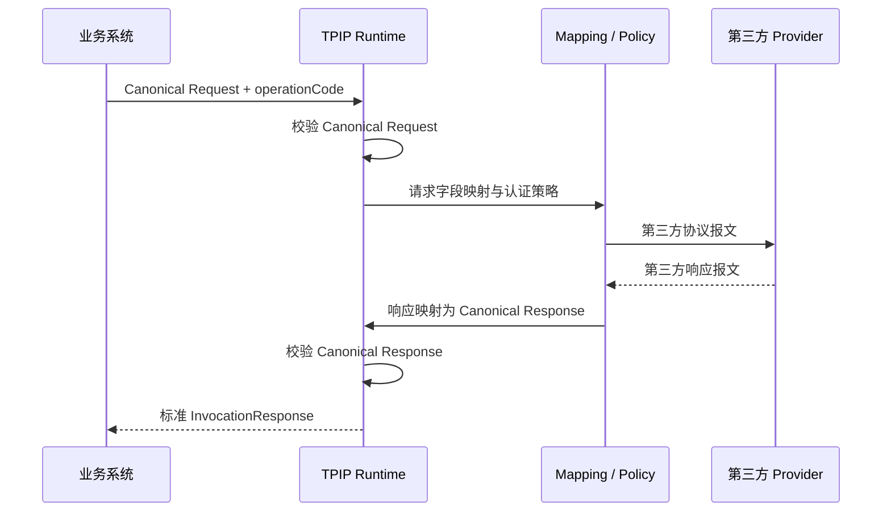

# 业务系统接入 TPIP 指南

> 本文同时面向业务系统研发人员和 TPIP 集成配置人员。  
> 完整可执行参考：`e2e/customer-lookup/bootstrap.sh` 与 `deploy-and-verify.sh`。

## 1. 接入原则

业务系统只依赖三个稳定内容：

1. TPIP Runtime 地址；
2. Canonical `operationCode`；
3. Canonical Request/Response Contract。

业务系统不应依赖：

- 第三方 URL、资源路径和 HTTP Method；
- `member_no`、`mobile_no` 等第三方字段；
- 第三方 API Key、Token 或签名规则；
- ProviderContract、MappingVersion、Bundle 或 Deployment 主键；
- Control Plane 管理 API。



## 2. 角色分工

| 角色 | 主要工作 |
| --- | --- |
| 业务负责人 | 确认业务语义、Canonical 字段和成功标准 |
| 业务系统研发 | 按 Runtime 标准契约调用、处理标准错误和超时 |
| TPIP 集成开发 | 配置 Provider、Contract、Mapping、Policy、Fixture 和 Binding |
| 平台发布人员 | Workspace 验证、审批、Bundle、Deployment 和回滚 |
| 第三方负责人 | 提供协议、测试环境、认证、限流、错误码和变更通知 |

本地单用户环境允许同一人承担多个角色，但资产和验证步骤仍应保留。

## 3. 接入前需要准备的信息

### 3.1 业务侧

- 业务操作名称和稳定 `operationCode`；
- 同步/异步模式；
- 幂等等级；
- 数据分级；
- Canonical 请求、响应和错误语义；
- 调用量、峰值、延迟目标和可用性目标；
- 是否需要租户、幂等键和业务截止时间。

### 3.2 第三方侧

- Provider 名称和负责人；
- 测试/生产地址、资源路径和 HTTP Method；
- 请求、成功响应、失败响应示例；
- 认证、签名和凭证轮换规则；
- 连接、读取和总超时；
- 限流、重试和幂等约束；
- IP 白名单、TLS 和网络要求；
- 字段枚举、空值、数组和日期格式。

## 4. 示例业务场景

业务系统需要根据客户编号查询客户资料，稳定操作定义为：

```text
operationCode = customer.profile.lookup
```

Canonical Request：

```json
{
  "customerId": "C1001"
}
```

Canonical Response：

```json
{
  "customerId": "C1001",
  "customerName": "张三",
  "mobile": "13800138000",
  "status": "ACTIVE"
}
```

某第三方实际使用：

```json
{
  "member_no": "C1001"
}
```

并返回：

```json
{
  "code": "0",
  "data": {
    "member_no": "C1001",
    "member_name": "张三",
    "mobile_no": "13800138000",
    "member_status": "ACTIVE"
  }
}
```

这些差异由 TPIP Mapping 吸收，业务系统始终使用 `customerId/customerName/mobile/status`。

## 5. 平台配置顺序

Control Plane API 基地址为 `http://127.0.0.1:18080/control/v1`。所有写请求必须包含：

```http
Content-Type: application/json
X-Operator: <local-audit-operator>
```

UI 模式使用 18082。`X-Operator` 当前只用于本地审计，不是认证凭据。更新稳定资产或执行状态转换时必须携带最新
`rowVersion`；发生 409 后重新读取，不得在未知当前状态的情况下自动重放命令。

### 5.1 建立 Canonical 业务目录

依次创建：

```text
BusinessDomain → CanonicalCapability → CanonicalOperation
```

Operation 应稳定表达业务能力，例如 `customer.profile.lookup`，不要使用供应商名、环境或版本号。

推荐 Operation 属性：

```json
{
  "operationCode": "customer.profile.lookup",
  "operationName": "客户资料查询",
  "invocationMode": "SYNC",
  "idempotencyClass": "IDEMPOTENT",
  "dataClassification": "INTERNAL",
  "ownerCode": "customer-team"
}
```

### 5.2 建立 Canonical Contract

为 Operation 分别建立 `REQUEST` 和 `RESPONSE` Contract，再创建不可变 ContractVersion。Schema 应：

- 描述业务语义而不是第三方报文；
- 明确 required、类型、枚举、长度和 `additionalProperties`；
- 提供不含敏感信息的 example；
- 使用语义版本；
- 发布后不修改，变化时创建新版本。

请求 Schema 示例：

```json
{
  "type": "object",
  "required": ["customerId"],
  "properties": {
    "customerId": { "type": "string", "minLength": 1, "maxLength": 40 }
  },
  "additionalProperties": false
}
```

### 5.3 建立 Provider 与 CredentialRef

Provider 表示外部系统稳定身份。CredentialRef 只保存 Secret 引用：

```json
{
  "providerId": 101,
  "credentialCode": "vendor.customer.api-key",
  "environmentCode": "test",
  "credentialType": "API_KEY",
  "secretUri": "env://TPIP_SECRET_VENDOR_CUSTOMER_API_KEY",
  "secretMetadata": { "purpose": "customer-lookup" }
}
```

实际值只放在 Runtime/Control Plane 对应进程环境中：

```bash
export TPIP_SECRET_VENDOR_CUSTOMER_API_KEY='<secret-value>'
```

不得把实际 Secret 放入 `secretMetadata`、Endpoint、Policy、Fixture 或业务请求。

### 5.4 建立 ProviderContract 与 Endpoint

ProviderContractVersion 保存第三方请求、响应、错误和回调 Schema。Endpoint 保存环境化执行信息：

```json
{
  "providerContractId": 201,
  "endpointCode": "vendor.customer.lookup",
  "environmentCode": "test",
  "protocolScheme": "HTTPS",
  "baseUrl": "https://api.vendor.example",
  "resourcePath": "/vendor/v1/members/query",
  "httpMethod": "POST",
  "contentType": "application/json",
  "charsetName": "UTF-8",
  "connectTimeoutMs": 1000,
  "readTimeoutMs": 2000,
  "totalTimeoutMs": 3000,
  "credentialRefId": 301,
  "networkConfig": {},
  "tlsConfig": null
}
```

发布 Endpoint 前执行 Probe。Endpoint 发布后地址变化应创建新 Revision。

### 5.5 创建 Binding

Binding 表示“一个 Canonical Operation 由某个 ProviderContract 实现”。一个 Operation 可以有多个 Binding，支持未来
更换供应商或按环境、路由属性选择实现。

### 5.6 配置请求 Mapping

方向使用 `OUTBOUND_REQUEST`：

```json
{
  "ruleCode": "customer-id-to-member-no",
  "ruleOrder": 10,
  "valueSource": "SELECTOR",
  "sourceSelector": "$.customerId",
  "targetSelector": "$.member_no",
  "targetType": "STRING",
  "required": true,
  "missingStrategy": "FAIL",
  "errorStrategy": "FAIL",
  "enabled": true
}
```

先调用 Mapping `:test`，确认输出为第三方请求，再发布 MappingVersion。

### 5.7 配置响应 Mapping

方向使用 `INBOUND_RESPONSE`，示例规则：

| 第三方 JSONPath | Canonical JSONPath |
| --- | --- |
| `$.data.member_no` | `$.customerId` |
| `$.data.member_name` | `$.customerName` |
| `$.data.mobile_no` | `$.mobile` |
| `$.data.member_status` | `$.status` |

字段缺失、类型不匹配和枚举转换必须显式决定是失败、默认还是受控转换，不能静默丢失。

### 5.8 配置 Policy DSL

认证和 Transport Header 不属于普通字段映射。API Key 示例：

```json
{
  "apiVersion": "tpip.policy/v1alpha1",
  "kind": "PolicyChain",
  "stages": {
    "AFTER_REQUEST_MAPPING": [
      {
        "id": "inject-request-id",
        "use": "builtin.transport.inject@1.0.0",
        "with": { "headers": { "X-Request-Id": "${context.requestId}" } },
        "onFailure": "FAIL"
      }
    ],
    "BEFORE_TRANSPORT": [
      {
        "id": "provider-api-key",
        "use": "builtin.auth.api-key@1.0.0",
        "with": {
          "secretRef": "env://TPIP_SECRET_VENDOR_CUSTOMER_API_KEY",
          "headerName": "X-API-Key",
          "prefix": "ApiKey "
        },
        "onFailure": "FAIL"
      }
    ]
  }
}
```

发布前读取 `/plan`，确认编译后的能力、阶段和 checksum 符合预期。

### 5.9 冻结 BindingVersion

BindingVersion 必须精确引用已发布的：

- Canonical Request/Response ContractVersion；
- ProviderContractVersion；
- Endpoint Revision；
- Request/Response MappingVersion；
- 可选 PolicyVersion、Error/Callback MappingVersion。

发布时平台重新校验依赖闭包。发布后的 BindingVersion 是进入 Workspace 和 Bundle 的冻结边界。

### 5.10 FixtureSuite 与 Workspace 验证

Fixture 至少覆盖：

- 请求映射成功；
- 响应映射成功；
- 必填字段缺失；
- 非法附加字段；
- Provider 4xx/5xx；
- Transport 超时；
- 第三方响应 Schema 不合法；
- 认证注入；
- Canonical 响应 Schema。

REMOTE_CALL Fixture 默认关闭。启用时必须限制环境、Host、Port、调用数量、请求/响应大小和总超时。

在 Workspace 中加入 BindingVersion，执行服务端验证。只有真实 Check 全部通过后才能提交评审和批准。

### 5.11 Bundle 与 Deployment

批准后的 Workspace 编译 Bundle：

```text
APPROVED Workspace → READY Bundle → PUBLISHED Bundle
```

再创建 Deployment：

```text
CREATED → PREHEAT/READY → ACTIVE
```

预热会让 Runtime 拉取 Bundle 并验证兼容性、Secret Resolver 和 checksum。激活后 Control Plane 才向 Runtime 提供
该 `operationCode + environmentCode` 的活动路由。

## 6. 业务系统调用契约

### 6.1 URL

```http
POST http://127.0.0.1:18081/integration/v1/operations/{operationCode}:invoke
Content-Type: application/json
```

业务系统只调用 Runtime，不调用 `/control/v1/**` 或 `/runtime-config/v1/**`。

### 6.2 请求

```json
{
  "meta": {
    "requestId": "order-service-20260809-000001",
    "caller": "order-service",
    "tenantId": null,
    "idempotencyKey": null,
    "deadline": null,
    "attributes": {
      "traceId": "trace-order-20260809-000001"
    }
  },
  "payload": {
    "customerId": "C1001"
  }
}
```

字段要求：

| 字段 | 说明 |
| --- | --- |
| `requestId` | 必填，调用方生成并保证可追踪；重试时是否复用应由幂等策略决定 |
| `caller` | 必填，稳定的业务系统标识 |
| `tenantId` | 可选，多租户业务标识，不作为当前认证凭据 |
| `idempotencyKey` | 可选，仅在 Operation 和 Provider 支持幂等时使用 |
| `deadline` | 可选，ISO-8601 UTC 时间，例如 `2026-08-09T12:00:00Z` |
| `attributes` | 非敏感追踪扩展，不得放密码、Token 或大报文 |
| `payload` | 必填，必须符合 Canonical Request Contract |

### 6.3 成功响应

```json
{
  "meta": {
    "requestId": "order-service-20260809-000001",
    "traceId": "trace-order-20260809-000001",
    "operationCode": "customer.profile.lookup",
    "bundleVersion": "1.0.0",
    "providerCode": "vendor-customer",
    "durationMs": 36
  },
  "result": {
    "success": true,
    "code": "SUCCESS",
    "message": "处理成功"
  },
  "payload": {
    "customerId": "C1001",
    "customerName": "张三",
    "mobile": "13800138000",
    "status": "ACTIVE"
  }
}
```

### 6.4 失败语义

除 Bundle/路由解析失败外，Runtime Pipeline 业务执行失败通常仍返回 HTTP 200，调用方必须检查
`result.success` 和 `result.code`，不能只判断 HTTP 状态。

| HTTP | `result.code` 或错误码 | 含义 | 调用方建议 |
| ---: | --- | --- | --- |
| 200 | `CANONICAL_REQUEST_INVALID` | 业务请求不符合标准 Contract | 修正请求，不重试 |
| 200 | `REQUEST_MAPPING_FAILED` | 请求映射失败 | 告警并联系 TPIP 配置人员 |
| 200 | `PROVIDER_REQUEST_INVALID` | 映射结果不符合第三方 Contract | 告警，不盲目重试 |
| 200 | `POLICY_EXECUTION_FAILED` | Policy 或 Secret 解析失败 | 告警，检查策略和凭证 |
| 200 | `TRANSPORT_FAILED` | 连接、读取或总超时等 Transport 异常 | 仅按幂等和重试预算处理 |
| 200 | `PROVIDER_HTTP_ERROR` | 第三方返回非成功 HTTP | 根据供应商语义分类处理 |
| 200 | `PROVIDER_RESPONSE_INVALID` | 第三方响应不符合 ProviderContract | 告警，保留 requestId |
| 200 | `RESPONSE_MAPPING_FAILED` | 响应字段映射失败 | 告警并联系 TPIP 配置人员 |
| 200 | `CANONICAL_RESPONSE_INVALID` | 映射结果不符合 Canonical Response | 告警，不向下游传播脏数据 |
| 200 | `DEADLINE_EXCEEDED` | 业务截止时间已过 | 不重试或使用新的业务请求 |
| 200 | `PIPELINE_FAILED` | 未分类运行异常 | 告警并人工分析 |
| 503 | `TPIP_RUNTIME_BUNDLE_UNAVAILABLE` | 没有可用 Bundle/Route/LKG | 短暂退避后重试并告警 |

只有 `IDEMPOTENT` 或已经建立可靠幂等键的操作才允许自动重试。不要因为 HTTP 200 就把业务失败当成功。

## 7. curl 调用示例

```bash
curl -sS -X POST \
  http://127.0.0.1:18081/integration/v1/operations/customer.profile.lookup:invoke \
  -H 'Content-Type: application/json' \
  --data-binary '{
    "meta": {
      "requestId": "manual-000001",
      "caller": "order-service",
      "tenantId": null,
      "idempotencyKey": null,
      "deadline": null,
      "attributes": {"traceId":"trace-manual-000001"}
    },
    "payload": {"customerId":"C1001"}
  }'
```

## 8. Java 业务系统调用建议

业务系统可以用 Spring `RestClient`、`WebClient` 或 JDK `HttpClient` 封装统一 TPIP Client。封装层必须：

1. 生成并记录 `requestId/traceId`；
2. 设置整体调用超时；
3. 区分 HTTP 503 和 HTTP 200 业务失败；
4. 校验 `result.success`；
5. 将 `result.code` 映射为业务系统内部受控异常；
6. 仅对允许幂等的错误执行有界重试；
7. 日志脱敏，不打印 Secret 或完整敏感报文；
8. 指标至少包含 Operation、结果码、耗时和调用方，不把高基数字段作为标签。

不建议每个业务模块各写一套 HTTP 调用代码。应在业务系统内部建立一个小型 `TpipClient` 适配层，但该适配层只封装
TPIP 标准调用契约，不重新引入供应商 SDK 或第三方字段。

## 9. 变更与兼容

### 9.1 第三方字段变化

创建新的 ProviderContractVersion 和 MappingVersion，走 Workspace、Bundle、Deployment 流程。Canonical Contract
不变时，业务系统不改代码。

### 9.2 第三方地址或凭证变化

- 地址变化：创建新 Endpoint Revision；
- Secret 值轮换：更新受控 Secret 存储或环境变量，不把新值写入资产；
- 认证机制变化：创建新 CredentialRef/PolicyVersion 和 BindingVersion。

### 9.3 Canonical Contract 变化

只有业务语义确实变化时才升级 Canonical Contract。先评估兼容性，再由业务系统和 TPIP 同步升级。不要为了适配某个
供应商字段而污染 Canonical Contract。

## 10. 上线前验收清单

- [ ] Operation Code 稳定且不含供应商、环境和版本；
- [ ] Canonical Request/Response Schema 已发布；
- [ ] ProviderContract 的成功和错误报文已覆盖；
- [ ] Endpoint 环境、HTTPS、超时和探测正确；
- [ ] Secret 只通过 CredentialRef 引用；
- [ ] 请求和响应 Mapping Fixture 全部通过；
- [ ] Policy Plan 已检查；
- [ ] BindingVersion 依赖闭包已发布；
- [ ] Workspace 服务端验证实际 PASSED；
- [ ] 高风险 Workspace 的评审阶段符合要求；
- [ ] Bundle 已发布且 checksum 可读取；
- [ ] Deployment 预热成功并已按计划激活；
- [ ] 成功、非法请求、第三方 4xx/5xx、超时、坏响应均已测试；
- [ ] 业务系统同时处理 HTTP 状态和 `result.code`；
- [ ] 自动重试符合幂等约束和预算；
- [ ] 监控、告警、回滚和第三方负责人已明确；
- [ ] 没有 Secret 出现在代码、数据库业务 JSON、日志和验收证据中。

## 11. 可直接运行的参考实现

当前仓库的 Customer Lookup E2E 已完整实现本文流程：

```bash
python3 e2e/customer-lookup/mock-provider.py
./e2e/customer-lookup/bootstrap.sh
./e2e/customer-lookup/deploy-and-verify.sh e2e/customer-lookup/evidence/{runId}
./e2e/customer-lookup/verify-rollback.sh e2e/customer-lookup/evidence/{runId}
```

其中：

- `bootstrap.sh` 是所有 Control Plane 资产请求的权威可执行示例；
- `deploy-and-verify.sh` 是 Deployment 和 Runtime 调用示例；
- `verify-rollback.sh` 是 Canary 和回滚示例；
- `evidence/{runId}` 保存每一步请求、响应、指标和验收摘要。

业务系统首次接入建议先复制该业务场景的资产顺序和验收结构，再替换业务 Contract 与第三方报文，不要从零发明流程。
