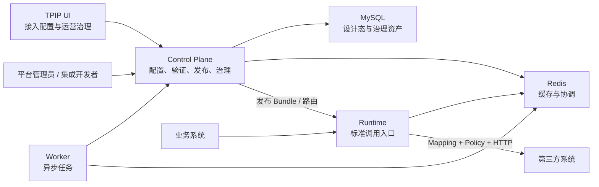

# TPIP 平台功能说明与使用手册

> MCP本地接入属于独立演进中的产品能力，当前启用和验证方式见 [TPIP MCP Edition 本地使用指南 v0.1](./tpip-mcp-edition-local-usage-v0.1.md)。

> 适用版本：当前本地工程基线（Java `0.1.0-SNAPSHOT`、UI `0.1.0`、Flyway `V46`、Runtime `0.2.0`）
> 使用范围：本地单机、单用户研发和架构验证环境

## 1. 平台定位

TPIP（Third-Party Integration Platform）位于业务系统与外部渠道、供应商或 SaaS 之间，作为统一防腐层吸收：

- 外部接口地址、协议和认证差异；
- 相同业务含义在不同第三方报文中的字段差异；
- 请求、响应和错误报文结构差异；
- 发布、灰度、回滚、缓存和健康治理；
- 第三方调用的验证、审计、回归和漂移治理。

业务系统面向稳定的 Canonical Contract 编程，不应把第三方字段、URL、API Key 或厂商 SDK 细节写入业务代码。

## 2. 系统组成



| 应用 | 默认端口 | 主要职责 | 业务系统是否调用 |
| --- | ---: | --- | --- |
| Control Plane | 18080 | 资产配置、版本发布、Workspace 验证、Bundle、Deployment、治理 API | 否 |
| Runtime | 18081 | 标准调用、Mapping、Policy、第三方 HTTP Transport | 是 |
| Worker | 8082 | 健康评估、通知投递、Global Impact 等异步任务 | 否 |
| UI | 18100 | 第三方接入配置，以及 Workspace、漂移和 Global Impact 运营治理 | 否 |
| MySQL | 3306 | 配置、版本、发布与治理事实 | 否 |
| Redis | 6379 | Bundle/路由缓存、租约、防重和冷却 | 否 |

## 3. 当前功能

### 3.1 第三方接入资产

- 业务域、业务能力和 Canonical Operation；
- Canonical Request/Response Contract 与不可变版本；
- Provider、CredentialRef、ProviderContract 与版本；
- Endpoint 不可变修订、环境隔离、探测历史；
- Binding、请求/响应 Mapping、Policy DSL 与冻结 BindingVersion。

面向配置人员的产品层级为：

```text
提供方（阿里云）
  └── 产品/服务（短信服务）
        ├── 接入通道（国内短信生产通道）
        └── 第三方接口（发送短信）
```

一个提供方可以有短信、对象存储、人脸识别等多个产品。选择产品后，界面只显示该产品下的通道和接口；后端也会拒绝跨提供方或跨产品组合。

平台对不可变资产自动管理版本号。第三方协议、业务标准报文和发布包的首个版本为 `1.0.0`，后续新建默认自动增加修订号。用户只说明变更内容，不手工输入版本号。

### 3.2 Mapping

- JSONPath Profile 1.0；
- 请求 `OUTBOUND_REQUEST` 和响应 `INBOUND_RESPONSE` 双向映射；
- 常量、默认值、类型转换、缺失和错误处理策略；
- 版本编译、单独 Fixture 测试、checksum 和发布；
- 第三方字段变化时通过新 MappingVersion 适配，不改变业务系统 Canonical Contract。

### 3.3 Policy

- 类型化、受限制的 Policy DSL，不执行任意 Groovy；
- API Key 和受控 Header 注入；
- Policy Type Registry、版本编译和执行计划；
- 按 Runtime Pipeline 阶段执行；
- Secret 只通过 `secretRef` 交给受控 Provider，DSL 不读取 Secret 原文。

当前尚未提供生产级 OAuth2、HMAC、签名、加解密 Provider。

### 3.4 验证与发布

- BindingVersion 依赖闭包冻结；
- FixtureSuite 与不可变 FixtureSuiteVersion；
- ConfigurationWorkspace 服务端验证；
- Mapping、Schema、Policy Expression 和受控 REMOTE_CALL 断言；
- Workspace 评审、批准、Bundle 编译和发布；
- Deployment 预热、激活、流量调整和回滚；
- Runtime Bundle 三层 checksum、L1 缓存和 Last Known Good 回退。
- 服务路由随 Bundle 冻结并由 Runtime 执行：支持条件、优先级、权重、人工摘流和被动健康过滤；Runtime 不读取设计态路由表。

### 3.5 运行与运维治理

- 标准 Runtime 请求与响应；
- Canonical 请求/响应校验；
- Endpoint 超时和最大报文限制；
- 分阶段指标、审计和 Prometheus 指标；
- Deployment 健康评估、告警和自动回滚骨架；
- Notification Outbox、渠道路由、重试、Dead Letter 和归档；
- 本地文件/S3 兼容归档适配器。

### 3.6 Verification 与漂移治理

- 回归基线、手动和定时回归；
- 漂移报告确认、接受、忽略和后继基线；
- Workspace 漂移工作台、负责人、批量命令和 Dry Run；
- 治理策略、SLA、影响分析和不可变快照；
- 提醒执行账本、批次、替代血缘、Outbox 和审计时间线；
- Global Impact 分片任务、进度、封板快照和 UI 查询模型。

### 3.7 交付质量

- Customer Lookup 本地端到端接入场景；
- UI Playwright 可回滚治理门禁；
- v0.20 JSON/Markdown 治理证据；
- v0.21 本地发布封板、制品 checksum 和防篡改复核。

## 4. 当前限制

- 无登录、OIDC/JWT 和 RBAC，仅允许本机单用户使用；
- `X-Operator` 是审计标签，不是可信身份；
- UI 已覆盖 Canonical、Provider、CredentialRef、ProviderContract、Endpoint、Binding、JSONPath Mapping、Policy、BindingVersion、FixtureSuite、Workspace 服务端验证、评审批准、Bundle 发布、Deployment 和 Runtime 标准调用；
- 接入向导负责进度聚合、缺口定位和断点恢复；具体资产仍在专家工作台中受控配置；
- 默认 Secret Resolver 为受限环境变量适配器；
- Bundle 和发布证据当前为 `UNSIGNED`；
- 本地 MinIO 联调和外部身份平台均为按需待办；
- 不得直接暴露到公网或不可信网络。

## 5. 启动前检查

需要：JDK 21、Node.js、Maven、MySQL、Redis。当前本地 Schema 为 `tpip_platform`，Flyway 由 Control Plane
启动时校验并迁移，禁止自动 clean。

```bash
export TPIP_MYSQL_HOST=127.0.0.1
export TPIP_MYSQL_PORT=3306
export TPIP_MYSQL_DATABASE=tpip_platform
export TPIP_MYSQL_USERNAME=root
export TPIP_MYSQL_PASSWORD='<local-password>'
export TPIP_REDIS_HOST=127.0.0.1
export TPIP_REDIS_PORT=6379
```

密码不得写入版本库、浏览器 Local Storage、Mapping、Policy 或 Endpoint JSON。

如果使用多个终端分别启动应用，每个终端都必须加载上述公共环境变量；也可以复制
`config/application-local.example.yml` 为被忽略的 `config/application-local.yml`，再启用 local Profile。

## 6. 两种本地启动方式

### 6.1 API 接入与 Customer Lookup E2E 模式

该模式使用默认 Control Plane 端口 18080：

```bash
java -jar tpip-control-plane-app/target/tpip-control-plane-app-0.1.0-SNAPSHOT.jar
```

```bash
TPIP_CONTROL_PLANE_BASE_URI=http://127.0.0.1:18080 \
  java -jar tpip-runtime-app/target/tpip-runtime-app-0.1.0-SNAPSHOT.jar
```

```bash
TPIP_CONTROL_PLANE_BASE_URI=http://127.0.0.1:18080 \
  java -jar tpip-worker-app/target/tpip-worker-app-0.1.0-SNAPSHOT.jar
```

Worker 中 Global Impact、通知 Dispatcher 和健康 Worker 默认均关闭；只启动进程不会自动执行这些任务。

### 6.2 UI 工作台模式

当前 Vite 开发代理固定指向本机 18082，因此使用 UI 时建议统一使用以下拓扑：

```bash
TPIP_CONTROL_PORT=18082 \
  java -jar tpip-control-plane-app/target/tpip-control-plane-app-0.1.0-SNAPSHOT.jar
```

```bash
TPIP_CONTROL_PLANE_BASE_URI=http://127.0.0.1:18082 \
  java -jar tpip-runtime-app/target/tpip-runtime-app-0.1.0-SNAPSHOT.jar
```

```bash
TPIP_CONTROL_PLANE_BASE_URI=http://127.0.0.1:18082 \
  java -jar tpip-worker-app/target/tpip-worker-app-0.1.0-SNAPSHOT.jar
```

```bash
cd tpip-ui
npm run dev
```

浏览器访问 `http://127.0.0.1:18100`。不要同时启动占用 18080/18082 的重复 Control Plane 实例。

## 7. 健康检查

```bash
curl -fsS http://127.0.0.1:18080/actuator/health
curl -fsS http://127.0.0.1:18081/actuator/health
curl -fsS http://127.0.0.1:8082/actuator/health
curl -fsS http://127.0.0.1:18081/actuator/health/readiness
```

UI 模式把第一个地址替换为 18082。Runtime Readiness 不通过时，不应接收业务流量。

首次体验完整第三方接入时，建议直接执行 `e2e/customer-lookup`。该场景会启动本地 Mock Provider、创建全套资产、
执行 Fixture、发布 Bundle、激活 Deployment，并验证成功、非法请求、第三方异常、超时、坏响应、Canary 和回滚。
REMOTE_CALL Fixture 的 Control Plane 白名单和 Secret 环境变量要求见
`e2e/customer-lookup/README.md`，不要在无白名单环境中直接开启远程 Fixture。

## 8. UI 功能入口

| 路由 | 功能 |
| --- | --- |
| `/integration-assets` | 产品化接入总览和推荐配置路径（默认首页） |
| `/integration-assets/provider-access` | 第三方系统以及现有技术资产配置入口 |
| `/integration-assets/channels` | 按“第三方 → 产品/服务”筛选通道，管理 baseUrl、凭据、公共参数和公共规则 |
| `/integration-assets/interfaces` | 按第三方名称、接口名称、Method 和完整地址展示的第三方接口视图 |
| `/integration-assets/services` | 创建 serviceCode、标准请求/返回、第三方实现，并配置版本化多目标路由和 Dry Run |
| `/integration-assets/wizard` | 测试与发布进度、缺口定位、专家页面跳转和本地断点恢复 |
| `/integration-assets/canonical` | Domain、Capability、Operation、Canonical Contract 与 Schema Version |
| `/integration-assets/provider-contract-versions` | 第三方 Request/Response/Error/Callback Schema 版本 |
| `/integration-assets/mappings` | Binding、JSONPath Mapping、样例测试和版本发布 |
| `/integration-assets/policies` | Policy Type Registry、Policy DSL、编译计划和版本发布 |
| `/integration-assets/binding-versions` | 执行依赖闭包冻结、发布和 Bundle Manifest 预览 |
| `/integration-assets/fixture-suites` | FixtureSuite、多 Case、FAP 断言和不可变测试版本发布 |
| `/integration-assets/workspaces` | Workspace 创建、BindingVersion 装配、服务端验证、Check 证据和重试 |
| `/integration-assets/releases` | Workspace 评审、分阶段批准、Bundle 编译、Manifest 和发布 |
| `/integration-assets/deployments` | Deployment 创建、预热、激活、灰度扩量、回滚和证据查看 |
| `/integration-assets/runtime-invoke` | ACTIVE Route 查询、Canonical Request 编辑和 Runtime 标准调用 |
| `/global-impact-jobs` | Global 策略影响任务列表 |
| `/global-impact-jobs/new` | 创建 Global Impact 任务 |
| `/global-impact-jobs/{jobId}` | 任务进度、Workspace 影响和时间线 |
| `/global-impact-snapshots/{snapshotId}` | 已封板影响快照 |
| `/global-impact-operations` | Global Impact 运维总览 |
| `/governance-policies` | 治理策略资产 |
| `/workspaces` | Workspace 资产列表和详情 |
| `/drift-workbench` | 漂移治理待办和批量操作 |
| `/drift-operations/{commandKey}` | 治理命令证据 |
| `/drift-governance-metrics` | SLA、负责人负载和趋势 |
| `/drift-governance-evaluations` | 治理评估和提醒候选 |
| `/drift-reminder-batches` | 提醒批次、替代、Outbox 和审计时间线 |

UI 无登录。所有写命令携带本地审计 Operator，并使用 Row Version 防止覆盖并发修改。

v0.23 将导航重构为“接入配置、服务管理、高级管理、运营治理”。普通入口使用第三方系统、接入通道、第三方接口、
接入服务和 serviceCode 等产品术语；Domain、CanonicalContract、Mapping、Policy、BindingVersion 和 Bundle 等现有资产
继续保留在高级管理中。接入通道现已支持独立 baseUrl、CredentialRef、公共参数、接口关联、接口覆盖/禁用和最终有效
配置预览；接入服务支持一次创建标准请求/返回、添加多个第三方实现，并按条件、人工状态、健康、优先级和权重配置
不可变路由版本。路由必须先保存 DRAFT、再发布，之后才能执行带完整排除原因和审计编号的 Dry Run。统一边界和聚合
API 契约见 `docs/tpip-product-model-and-ui-redesign-v0.23.md`。

从 V43 开始，BindingVersion 还可以显式选择一个接入通道。平台在发布时校验该通道与第三方、接口和 Endpoint 地址一致，
并在 Bundle 中冻结通道公共参数与接口覆盖后的最终执行计划。调用时会把固定值、请求字段、Mapping/Policy 输出、系统时间、
UUID 或 Secret 引用装配到 Header、Query、Path、Body、Cookie 或签名输入中。Secret 原文不会进入设计库或 Bundle；表达式逻辑
必须使用 Policy DSL，不能提交任意 Groovy。旧 BindingVersion 没有关联通道时仍按原有方式执行。

“服务管理 → 接入服务 → 查看与管理 → 添加第三方实现”提供完整执行向导。依次选择第三方接口、已发布报文结构版本、
接入通道和已发布接口调用版本；实际 Endpoint 由平台根据通道 Base URL 与接口 Method/Path 自动生成。账号凭据、认证方式、
公共参数和接口覆盖全部继承通道配置，不在这里重复填写 Secret 或签名规则。

点击“新增接入服务”时，先填写 serviceCode、服务名称和治理属性，再通过“业务字段表单”定义标准请求、标准返回字段。
每个字段填写中文含义、业务 JSONPath、类型、示例、必填和说明，平台自动生成并发布业务标准 JSON Schema 与样例。
无请求体或无返回字段时可以保持空字段列表；复杂数组、组合结构可以切换“高级 JSON Schema”。

字段映射区自动读取业务标准报文与第三方报文的字段，通过左右下拉框配置“业务请求 → 第三方请求”和“第三方返回 → 业务
返回”。字段名称相同的项目会自动预匹配；名称不同的字段由用户选择对应关系。点击“执行双向预览”可使用契约样例检查
JSONPath、必填字段和类型转换。点击“校验、生成并发布实现”后，平台在同一事务中生成 Endpoint 快照、双向 Mapping 和已发布
BindingVersion；失败时不会留下半套资产。

业务工作区中的“账号与认证”现已支持 OpenAPI 公开账号字段注入。创建账号凭据时，将 `appKey`、`AccessKeyId` 等保存为
公开账号标识，将 `appSecret`、`AccessKeySecret` 保存为 Secret 引用；配置认证方式时，勾选公开字段并选择发送位置、填写
第三方参数名。最终请求预览会显示注入位置和参数名，但不会读取 Secret 明文。

“公共参数与接口覆盖”页签用于处理其余请求封装：选择“通道所有接口”可配置公共 Header、Query、Body、Cookie 或 Path
参数；选择“某个接口专用”可覆盖或禁用同位置、同参数名的公共配置。常规取值方式已经表单化，包括固定值、业务请求传入、
Secret 引用、系统时间、UUID 和字段映射结果。Secret 在普通页面中仅允许放入 Header 或 Cookie；复杂签名进入高级执行规则。
当前通道的接口下拉只列出已绑定接口，不会混入同一第三方或产品下其他通道的接口。

第三方接口建立后，切换到“报文结构”页签维护真实请求和返回字段。点击“新增报文结构”，普通模式逐行填写中文含义、
JSONPath、字段类型、示例、必填和说明，平台会自动生成 JSON Schema 与报文样例；数组元素、组合类型等复杂协议可以切换
“高级 JSON Schema”。保存先生成草稿，确认后再发布。接口升级时新增版本，不修改已发布历史；存在多个已发布版本是正常的，
具体业务服务实现只会冻结其中一个版本。

通道与接口公共规则在“接入配置 → 接入通道”中维护：

1. 选择一个通道，在“公共规则与接口覆盖”选择“通道公共规则”；
2. 点击“新增规则版本”，勾选请求追踪号，或选择 API Key/HMAC-SHA256 并选择 Secret 凭据；
3. 点击“编译并创建草稿”，确认后点击“发布”；
4. 如果某个接口不同，切换到“接口覆盖规则”并选择接口；使用相同认证规则编码会覆盖通道认证，也可以填写
   `request-trace`、`authentication` 等上层规则编码将其禁用；
5. 重新执行 Workspace 验证、Bundle 编译和 Deployment 发布。仅发布策略版本不会修改线上或当前本地激活 Bundle。

最终顺序固定为“通道公共规则 → 接口覆盖规则 → 具体实现规则”。具体实现规则优先级最高；最终组合结果和 checksum 会冻结进
Bundle，Runtime 不读取策略配置表。

## 9. 常用操作流程

### 9.0 配置调用方服务授权

进入“服务管理 → 调用方管理”，依次完成：

1. 创建调用方项目；
2. 在项目下创建实际发起请求的调用方应用；
3. 新建调用凭据版本，填写`env://TPIP_SECRET_*`引用并发布；
4. 将需要使用的接入服务授权给该应用并发布授权版本；
5. 在Runtime进程启动环境中设置Secret引用对应的变量；
6. 在统一调用控制台填写App Key、本地签名密钥和授权场景，执行调用验证。

App Secret不会保存到数据库。发布授权后Runtime最多在30秒缓存刷新周期内读取到最新快照；撤销凭据同样受该缓存窗口影响。Redis必须可用，Runtime使用它记录nonce并阻止签名请求重放。

### 9.1 检查接入服务是否可以验证

完成业务标准报文和第三方实现后，进入“接入配置 → 接入服务”，点击“查看与管理”。详情顶部的“接入就绪检查”会自动给出结论：

- “暂不能验证”：展开阻断项或具体第三方实现，点击“去补齐”返回对应配置页面；
- “可以验证，有提示”：核心执行配置已完整，但需要确认提示事项，例如第三方接口是否确实允许匿名调用；
- “可以验证”：点击“进入验证与发布”，继续建立 FixtureSuite 和 Workspace，执行端到端验证与发布。

当服务只有一家第三方实现时无需配置调用选择；配置两家及以上实现后，必须在“多目标调用选择”中保存并发布覆盖全部启用实现的规则。新增实现或发布路由后，页面会自动重新检查，也可以手工点击“重新检查”。

### 9.2 新增第三方接口

按以下顺序配置：

```text
Domain → Capability → Operation → Canonical Contract
Provider → CredentialRef → ProviderContract → Endpoint
Binding → Mapping → Policy → BindingVersion
FixtureSuite → Workspace Verify/Approve → Bundle Publish
Deployment Preheat/Activate → Runtime Invoke
```

详细步骤见《业务系统接入 TPIP 指南》。

需要完全按照当前 UI 逐项填写的人工示例，请使用
[`TPIP 客户资料查询：全流程 UI 配置实例`](tpip-customer-profile-lookup-ui-tutorial.md)。该文档提供可直接复制的名称、
编码、Schema、JSONPath Mapping、Policy DSL、Fixture、Workspace、Bundle、Deployment 和 Runtime 请求。

### 9.3 修改第三方字段或地址

不要修改已发布版本：

1. 创建新的 ProviderContractVersion、MappingVersion 或 Endpoint Revision；
2. 单独测试并发布新版本；
3. 创建新的 BindingVersion；
4. 在新 Workspace 中验证、审批并编译 Bundle；
5. 创建 Deployment，预热后灰度或全量激活；
6. 出现异常时回滚到上一 Deployment。

业务系统继续使用原 `operationCode` 和 Canonical Contract；仅 Canonical Contract 真正发生业务语义变化时才要求业务改造。

### 9.4 发布封板

```bash
TPIP_RELEASE_EVIDENCE_DIR=/absolute/release/root \
  TPIP_MYSQL_PASSWORD='<local-password>' \
  e2e/release-evidence/seal-release.sh
```

只有 Java/UI 测试、制品、治理门禁、审计链和数据清理全部通过才会生成 `SEALED`。

## 10. 默认关闭的自动化

下列能力不会因应用启动自动执行，必须按场景显式配置：

- Regression Scheduler；
- Reminder Preview；
- Global Impact Worker；
- Notification Dispatcher；
- Health Worker；
- Notification Archive Automation；
- 在线 Attempt 清理；
- REMOTE_CALL Fixture。

启用前必须先阅读相应配置、安全白名单、租约和清理门禁文档。

## 11. 常见问题

| 现象 | 检查方向 |
| --- | --- |
| UI 显示 Control Plane 异常 | UI 开发代理要求 Control Plane 在 18082 |
| Runtime 返回 HTTP 503 | 没有 ACTIVE Route、Bundle 无法解析、checksum 失败或 LKG 不可用 |
| 调用 HTTP 200 但业务失败 | 检查响应 `result.success` 和 `result.code`，不能只看 HTTP 状态 |
| Endpoint Probe 失败 | 检查地址、网络、超时、CredentialRef 和第三方服务 |
| Workspace 无法评审 | 必须先产生带实际 Check 的 PASSED 验证任务 |
| Bundle 无法编译 | Workspace 未批准或 BindingVersion 依赖未全部发布 |
| Worker 没有执行任务 | 对应 Worker 开关默认关闭 |
| Secret 解析失败 | 检查 `secretUri` 引用的环境变量是否在实际执行进程中存在 |
| 写请求返回 409 | Row Version 已变化，重新读取资产后再决定，不自动重放 |

## 12. 参考入口

- 业务接入：`docs/tpip-business-system-integration-guide.md`；
- 完整可执行样例：`e2e/customer-lookup/README.md` 与 `bootstrap.sh`；
- 本地验收：`docs/local-end-to-end-acceptance-plan.md`；
- 工程目录：`docs/tpip-project-directory-guide.md`；
- 平台设计：`docs/third-party-integration-platform-redesign.md`；
- 集成标准：`docs/enterprise-external-system-integration-standard.md`。
- 调用方接入与服务授权：`docs/tpip-consumer-access-and-service-authorization-v0.25.md`。
